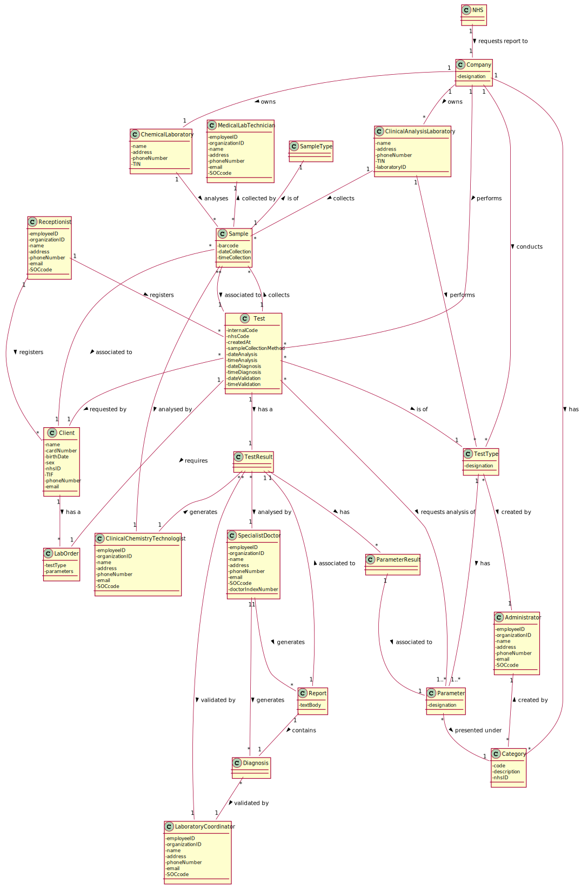

# OO Analysis #

The construction process of the domain model is based on the client specifications, especially the nouns (for _concepts_) and verbs (for _relations_) used. 

### _Conceptual Class Category List_ ###

**Business Transactions**

* Test

---

**Transaction Line Items**

* Sample
* Lab Order
* Test Result
* Diagnosis

---

**Product/Service related to a Transaction or Transaction Line Item**

* Parameter

---

**Transaction Records**

* 

---  

**Roles of People or Organizations**

* Client
* Administrator
* Medical Lab Technician
* Clinical Chemistry Technologist
* Laboratory Coordinator
* Specialist Doctor
* Receptionist

---

**Places**

* Clinical Analysis Laboratory
* Chemical Laboratory

---

**Noteworthy Events**

* Chemical Analysis

---

**Physical Objects**

*

---

**Descriptions of Things**

* Type of Test
* Type of Sample
* Category
* Type of User

---

**Catalogs**

*  

---

**Containers**

*  

---

**Elements of Containers**

*  

---

**Organizations**

* Company
* NHS

---

**Other External/Collaborating Systems**

*  

---

**Records of finance, work, contracts, legal matters**

* 

---

**Financial Instruments**

*  

---

**Documents mentioned/used to perform some work/**

* 
---

### _Associations between conceptual classes_ ###
| Concept (A) 		|  Association   |  Concept (B) |
|----------	   		|:--------------:|:------------:|
| Company  	        | 1. performs   2. conducts   3.owns| 1. Test   2. TestType   3. ClinicalAnalysisLaboratory   3. Chemical Laboratory      |
| Parameter | 1. presented under | 1. Category 
| Category  	| 1. created by    		 	| 1. Administrator  |
| Test | 1. requested by   2. is of   3. collects   4. requests analysis of   5. requires | 1. Client   2. TestType   3. Sample   4. Parameter   5. Lab Order |
| Sample | 1. is of   2. collected by   3. analysed by | 1. SampleType   2. Medical Lab Technician   3. Clinical Chemistry Technologist |
| Clinical Chemistry Technologist | 1. works at | 1. Chemical Laboratory |
| Receptionist | 1. registers | 1. Client   1. Test |
| Test Result | 1. generated by   2. analysed by   3. validated by | 1. Clinical Chemistry Technologist   2. Specialist Doctor   3. Lab Coordinator |
| Diagnosis | 1. generated by   2. validated by   3. associated to | 1. Specialist Doctor   2. Lab Coordinator   3. Test Result |
| NHS | 1. requests report of | 1. Test |
| Application | 1. is used by | 1. User   1. Administrator |

## Domain Model

