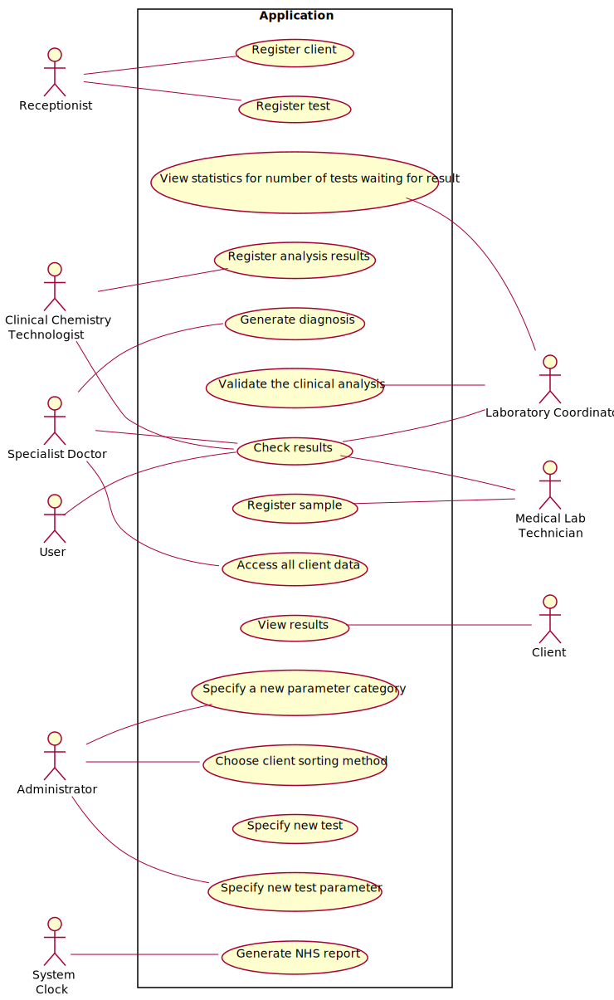

# Use Case Diagram (UCD)

**In the scope of this project, there is a direct relationship of _1 to 1_ between Use Cases (UC) and User Stories (US).**

**For each UC/US, it must be provided evidences of applying main activities of the software development process (requirements, analysis, design, tests and code). Gather those evidences on a separate file for each UC/US and set up a link as suggested below.**

# Use Cases / User Stories
| UC/US  | Name | Actor | Description                   
|:----|:------------------------------------------------------------------------|:---|:----|
| US1 | [Register test](US1.md)| Receptionist | Register in the application the test to be performed to a client. |
| US2 | [Register client](US2.md)| Receptionist | Register a new client in the application (required client’s citizen card number, NHS number, birth date, sex, TIF, phone number, e-mail and name. |
| US3 | [Register sample](US3.md)| Medical Lab Technician | Record the sample in the system, associating the samples with the client/test, and identifying each sample with a barcode. |
| US4 | [Register analysis results](US4.md)| Clinical Chemistry Technologist | Record the results of the chemical analysis on the samples. |
| US5 | [Generate diagnosis](US5.md) | Specialist Doctor | The results of all chemical analysis are automatically validated using test reference values. The doctor makes a diagnosis with that information and writes a report to deliver to the client. |
| US6 | [Choose sorting method](US6.md)| User (undefined) | Display the list of clients sorted by name or by TIF. |
| US7 | [Validate the clinical analysis](US7.md) | Laboratory Coordinator | Display the chemical test/result and associated diagnosis for validation. |
| US8 | [View results](US8.md) | Client, Medical Lab Technician, Clinical Chemistry Technologist, Specialist Doctor, Laboratory Coordinator | Notify the client by SMS and e-mail when results are available. Display the result information to all actors. |
| US9 | [View statistics for number of tests waiting for result](US9.md) | User (undefined) | Compute the time interval, in a week, when the company was less effective in responding. |
| US10 | [Access all client data](US10.md) | Specialist Doctor | Only the specialist doctor is allowed to access all client data. |
| US11 | [Get feedback from the Covid-19 tests made](US11.md) | NHS | NHS requires the number of COVID-19 tests performed, and to report the number of positive cases per day, week, month and year, generate forecasts and generate daily reports. |
| US12 | [Specify new test](US12.md) | Administrator | Specify a new type of test and its collecting methods. |
| US13 | [Specify new test parameter](US13.md) | Administrator | Specify a new test parameter and categorize it. |
| US14 | [Specify a new parameter category](US14.md) | Administrator | Specify a new test parameter category. | 