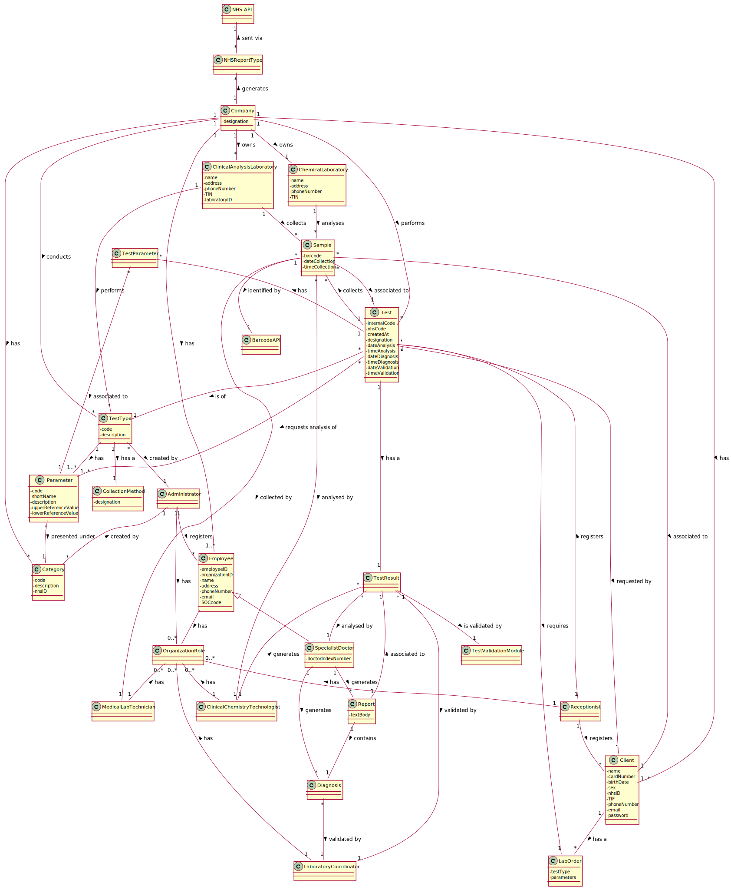

# OO Analysis #

The construction process of the domain model is based on the client specifications, especially the nouns (for _concepts_) and verbs (for _relations_) used. 

### Conceptual Class Category List ###

**Business Transactions**

* Test

---

**Transaction Line Items**

* Sample
* Lab Order
* Test Result
* Report

---

**Product/Service related to a Transaction or Transaction Line Item**

* Parameter
* Analysis Result / Parameter Result
* Diagnosis

---

**Transaction Records**

* 

---  

**Roles of People or Organizations**

* (Employee)
* Client
* Administrator
* Medical Lab Technician
* Clinical Chemistry Technologist
* Laboratory Coordinator
* Specialist Doctor
* Receptionist

---

**Places**
* (Laboratory)
* Clinical Analysis Laboratory
* Chemical Laboratory

---

**Noteworthy Events**

* Chemical Analysis

---

**Physical Objects**

*

---

**Descriptions of Things**

* Type of Test
* Type of Sample
* Category

---

**Catalogs**

*  

---

**Containers**

*  

---

**Elements of Containers**

*  

---

**Organizations**

* Company
* NHS

---

**Other External/Collaborating Systems**

*  

---

**Records of finance, work, contracts, legal matters**

* 

---

**Financial Instruments**

*  

---

**Documents mentioned/used to perform some work**

* 
--- 
**OBS**

The generalization classes **Employee** and **Laboratory** were not considered in this Domain Model. Despite the existence of company roles and places with common attributes that fall into these conceptual classes, they weren't used for simplicity's sake and to preserve readability in the graphical representation.

These classes might be considered, however, in the Design phase of this project.

### Associations between conceptual classes ###
| Concept (A) |  Association   |  Concept (B) |
|:----------  |:--------------|:------------|
| Category | 1. created by | 1. Administrator  |
| Client | 1. has a | 1. Lab Order |
| Clinical Analysis Laboratory | 1. performs | 1. Test Type |
| Company | 1. performs   2. conducts   3. owns   4. has | 1. Test   2. Test Type   3. Clinical Analysis Laboratory   3. Chemical Laboratory   4. Category |
| Diagnosis | 1. generated by   2. validated by   3. associated to | 1. Specialist Doctor   2. Lab Coordinator   3. Test Result |
| NHS | 1. requests report to | 1. Company |
| Parameter Result | 1. associated to | 1. Parameter |
| Parameter | 1. presented under | 1. Category |
| Receptionist | 1. registers | 1. Client   1. Test |
| Report | 1. contains   2. associated to   3. generated by | 1. Diagnosis   2. Test Result   3. Specialist Doctor |
| Sample | 1. is of   2. collected by   3. analysed by   4. associated to | 1. Sample Type   2. Clinical Analysis Laboratory   2. Medical Lab Technician   3. Chemical Laboratory   3. Clinical Chemistry Technologist   4. Client   4.Test |
| Test Result | 1. generated by   2. analysed by   3. validated by | 1. Clinical Chemistry Technologist   2. Specialist Doctor   3. Lab Coordinator |
| Test Type | 1. created by   2. has| 1. Administrator   2. Parameter|
| Test | 1. requested by   2. is of   3. collects   4. requests analysis of   5. requires   6. has a | 1. Client   2. Test Type   3. Sample   4. Parameter   5. Lab Order   6. Test Result |

## Domain Model

