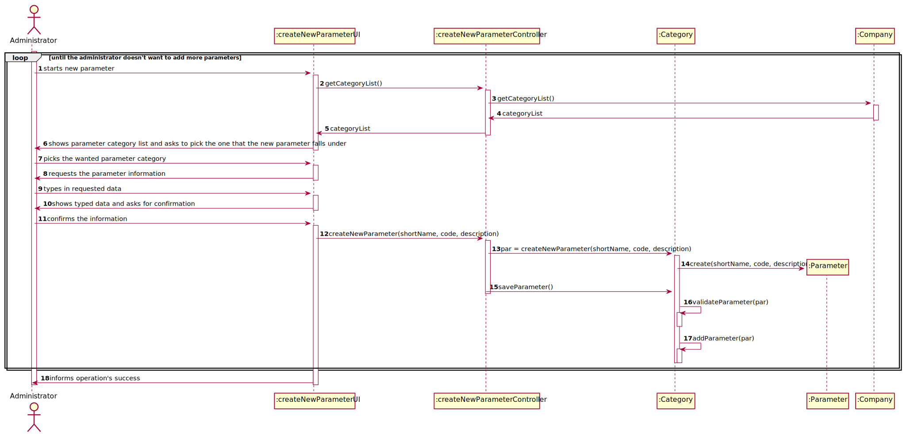

# US 7 -  Specify a new employee

## 1. Requirements Engineering

### 1.1. User Story Description

As an administrator, I want to specify a new parameter and categorize it.

### 1.2. Customer Specifications and Clarifications 

####From the specifications document

* "Blood tests are frequently characterized by measuring several parameters which for presentation/reporting purposes are organized by categories. For example, parameters such as the number of Red Blood cells (RBC), White Blood Cells (WBC) and Platelets (PLT) are usually presented under the blood count (Hemogram) category,"
* "Covid tests are characterized by measuring a single parameter stating whether it is a positive or a negative result."
* "Regardless, such tests rely on measuring one or more parameters that can be grouped/organized by categories."

####From the client clarifications

* **Question**: "Which information will the client provide for the addition of a new parameter and its categorization?" **Answer**: "Each parameter is associated with one category. Each parameter has a Code, a Short Name and a Description. The Code are five alphanumeric characters. The Short Name is a String with no more than 8 characters. The Description is a String with no more than 20 characters."

* **Question**: "Does the client want to specify more than one new parameter at a time?" **Answer**: "Yes."

* **Question**: "What are the acceptance criteria for a new parameter category?" **Answer**: "In my previous posts you can find other requirements that must be met in order to mark US11 as complete."

* **Question**: "When a new parameter is specified, should there always be a category it falls under prior to its specification and subsequent categorization?" **Answer**: "Each parameter is associated with one category."

### 1.3. Acceptance Criteria

* AC1: The code introduced should have 5 alphanumerical charaters.
* AC2: The name for the new parameter should be a string with no more than 8 characters.
* AC3: The description should be a string with less than 20 characters.

### 1.4. Found out Dependencies

* User story 10 is dependent on User story 11 considering the fact that the categorization of a new parameter requires the existance of a parameter category to include it in.

### 1.5 Input and Output Data

* **Typed data:** New parameter name; Code; Short description.
* **Selected data** Parameter category.

### 1.6. System Sequence Diagram (SSD)

### 1.7 Other Relevant Remarks

* **Special requirements**: None;
* **Data and/or technology variations**: None
* **Frequency**: This US will happen mostly in the application's setup but being possible to happen further along the line if needed.

## 2. OO Analysis

### 2.1. Relevant Domain Model Excerpt 

### 2.2. Other Remarks

*Use this section to capture some aditional notes/remarks that must be taken into consideration into the design activity. In some case, it might be usefull to add other analysis artifacts (e.g. activity or state diagrams).* 

## 3. Design - User Story Realization 

### 3.1. Rationale

**The rationale grounds on the SSD interactions and the identified input/output data.**

| Interaction ID | Question: Which class is responsible for... | Answer  | Justification (with patterns)  |
|:-------------  |:--------------------- |:------------|:---------------------------- |
| Step 1  		 |							 |             |                              |
| Step 2  		 |							 |             |                              |
| Step 3  		 |							 |             |                              |
| Step 4  		 |							 |             |                              |
| Step 5  		 |							 |             |                              |
| Step 6  		 |							 |             |                              |              

### Systematization ##

According to the taken rationale, the conceptual classes promoted to software classes are: 

 * 

Other software classes (i.e. Pure Fabrication) identified: 
 * CreateNewParameterUI  
 * CreateNewParameterController

## 3.2. Sequence Diagram (SD)

*In this section, it is suggested to present an UML dynamic view stating the sequence of domain related software objects' interactions that allows to fulfill the requirement.* 

## 3.3. Class Diagram (CD)

*In this section, it is suggested to present an UML static view representing the main domain related software classes that are involved in fulfilling the requirement as well as and their relations, attributes and methods.*

# 4. Tests 
*In this section, it is suggested to systematize how the tests were designed to allow a correct measurement of requirements fulfilling.* 

**_DO NOT COPY ALL DEVELOPED TESTS HERE_**

**Test 1:** Check that it is not possible to create an instance of the Example class with null values. 

	@Test(expected = IllegalArgumentException.class)
		public void ensureNullIsNotAllowed() {
		Exemplo instance = new Exemplo(null, null);
	}

*It is also recommended to organize this content by subsections.* 

# 5. Construction (Implementation)

*In this section, it is suggested to provide, if necessary, some evidence that the construction/implementation is in accordance with the previously carried out design. Furthermore, it is recommeded to mention/describe the existence of other relevant (e.g. configuration) files and highlight relevant commits.*

*It is also recommended to organize this content by subsections.* 

# 6. Integration and Demo 

*In this section, it is suggested to describe the efforts made to integrate this functionality with the other features of the system.*

# 7. Observations

*In this section, it is suggested to present a critical perspective on the developed work, pointing, for example, to other alternatives and or future related work.*

