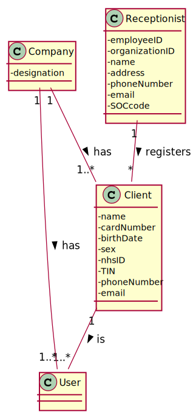
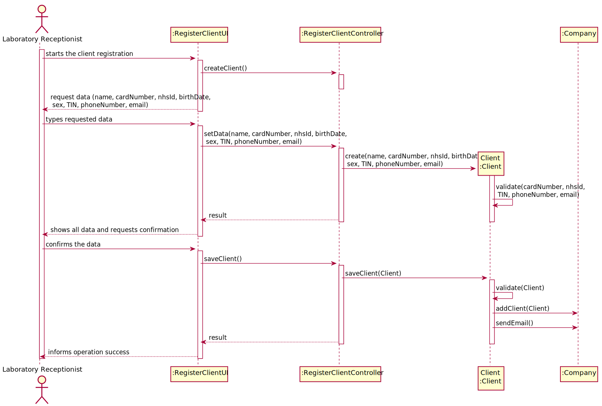

# US 3 -  Create a new Client

## 1. Engineering Requirements

### 1.1. User story Description

“As a receptionist of the laboratory, I want to register a client.”

### 1.2. Specifications and Clarifications

###  From the Specifications Document
•	“In case of a new client, the receptionist registers the client in the application. To register a client, the receptionist needs the client’s citizen card number, National Healthcare Service (NHS) number, birth date, sex, Tax Identification number (TIF), phone number, e-mail and name.”

•	“Once the laboratory coordinator confirms that everything was done correctly, the client receives a notification alerting that the results are already available in the central application and informing that he/she must access the application to view those results”

### From the client Clarifications

•	**Q1:** Does the administrator need to register a receptionist in the system, or do we have to assume that there is already a receptionist in the system?

**Answer:** …

•	**Q2**: Does the receptionist need to be logged in the app to preform the regist.

**Answer:** Yes.

•	**Q3**: What parameter (asked by the receptionist) should the system use to create the password of the new client?

**Answer:** The password should be randomly generated. It should have ten alphanumeric characters.

•	**Q4:** Relative to registering a new user, how should the system respond in the event of creating a new user with the same attributes of an already existing user?

**Answer:** This should be treated as an error. A subset of the attributes of any client are unique.

•	**Q5:** How are the passwords delivered to the users (client/employee)?

**Answer:** Each users receives an e-mail informing that the registration was successful and that he can start to use the system. The e-mail includes the user password.

•	**Q6:** Does the client need to tell his age to the recepcionis. Im asking because before you didnt especified that that would be a parameter?

**Answer:** No, only needs to tell the birth day (from a previous post). The application must validate and should not accept clients who have more than 150 years of age.

•	**Q7:** What should be the maximum length of the String with the name of the Client?

**Answer:** A string with no more than 35 characters.

### 1.3. Acceptance Criteria

•	**AC1:** The password used in authentication must have 10 alphanumeric characters, including 3 capital letters and 2 digits.

•	**AC2:** Only the specialist doctor is allowed to access all client data.

•	**AC3:** The client must become a system user. The "auth" component available on the repository must be reused (without modifications).

•	**AC4:** The Citizen Card must contain 16 digit number.

•	**AC5:** The NHS number must contain 10 digit number.

•	**AC6:** The TIN must contain 10 digit number.

•	**AC7:** Birthdate must be in the format DD/MM/YY.

•	**AC8:** The sex should only be Male/Female or include more options. 

•	**AC9:** The phone number must contain 11 digit number.

•	**AC10:** The sex is opcional. All other fields are required.

### 1.4. Found out Dependencies

There is a dependency to US7, before registering a new Client, a Laboratory Receptionist must be already registered.

### 1.5 Input and Output Data

####Input Data

•	Typed Data: Client Citizen Card Number, NHS number, birth date, TIN, phone number, e-mail, name.

•	Selected Data: sex

#### Output Data

•	(In)success of the operation.

### 1.6. System Sequence Diagram (SSD)

### 1.7 Other Relevant Remarks

*Use this section to capture other relevant information that is related with this US such as (i) special requirements ; (ii) data and/or technology variations; (iii) how often this US is held.* 

## 2. OO Analysis

### 2.1. Relevant Domain Model Excerpt 

### 2.2. Other Remarks

*Use this section to capture some aditional notes/remarks that must be taken into consideration into the design activity. In some case, it might be usefull to add other analysis artifacts (e.g. activity or state diagrams).* 

## 3. Design - User Story Realization 

### 3.1. Rationale

**The rationale grounds on the SSD interactions and the identified input/output data.**

| Interaction ID | Question: Which class is responsible for... | Answer  | Justification (with patterns)  |
|:-------------  |:--------------------- |:------------|:---------------------------- |
| Step 1  		 | Registering a new Client? |   Receptionist    |                              |
| Step 2  		 | Typing the data required? | Receptionist |                              |
| Step 3  		 | Creating and validating new Client? |  Client   |                              |
| Step 4  		 | Confirm the data? |  Receptionist  |                              |
| Step 5  		 | Sending email with registering confirmation and password   | CreateClientUI |                              |
| Step 6  		 | Inform operation success?  | Company |                              |
| Step 6  		 |	 |             |                              |              

### Systematization ##

According to the taken rationale, the conceptual classes promoted to software classes are: 

 * Receptionist
 * Client

Other software classes (i.e. Pure Fabrication) identified: 
 * CreateClientUI 
 * CreateClientController
 * Send

## 3.2. Sequence Diagram (SD)

## 3.3. Class Diagram (CD)

# 4. Tests 
*In this section, it is suggested to systematize how the tests were designed to allow a correct measurement of requirements fulfilling.* 

**_DO NOT COPY ALL DEVELOPED TESTS HERE_**

**Test 1:** Check that it is not possible to create an instance of the Example class with null values. 

	@Test(expected = IllegalArgumentException.class)
		public void ensureNullIsNotAllowed() {
		Exemplo instance = new Exemplo(null, null);
	}

*It is also recommended to organize this content by subsections.* 

# 5. Construction (Implementation)

*In this section, it is suggested to provide, if necessary, some evidence that the construction/implementation is in accordance with the previously carried out design. Furthermore, it is recommeded to mention/describe the existence of other relevant (e.g. configuration) files and highlight relevant commits.*

*It is also recommended to organize this content by subsections.* 

# 6. Integration and Demo 

*In this section, it is suggested to describe the efforts made to integrate this functionality with the other features of the system.*

# 7. Observations

*In this section, it is suggested to present a critical perspective on the developed work, pointing, for example, to other alternatives and or future related work.*

     
