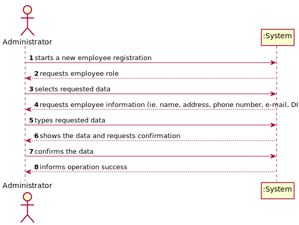
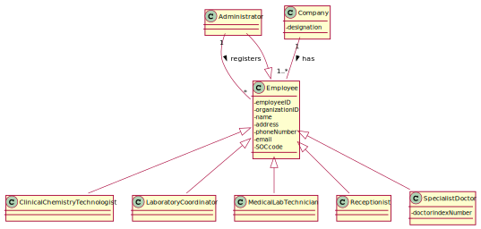

# US 7 -  Specify a new employee

## 1. Requirements Engineering

### 1.1. User Story Description

As an administrator, I want to register a new employee.

### 1.2. Customer Specifications and Clarifications 

**From the Specifications Document:**
* " All those who wish to use the application must be authenticated with a password holding seven alphanumeric characters, including three capital letters and two digits."

**From the client clarifications:**
* **Q**: What kind of information does the company store about their employees?
    * **A**: All the roles that exist in the Many Labs company are characterized by the following attributes:
      
      Employee ID;
      
      Organization Role;
      
      Name;
      
      Address;
      
      Phone Number;
      
      E-Mail;
      
      Standard Occupational Classification (SOC) code.

      The Specialist Doctor has an additional attribute:
      Doctor Index Number.
* **Q**: How should the system respond in the event of creating a new user with the same attributes of an already existing user?
    * **A**: This should be treated as an error. A subset of the attributes of any client are unique.
    
* **Q**: And what attributes (...) will trigger this response?
  * **A**: The e-mail address and phone number should be unique. The sex of each user is optional.

### 1.3. Acceptance Criteria

* AC1: Each user must have a single role defined in the system. 

* AC2: The "auth" component available on the repository must be reused (without
modifications).

### 1.4. Found out Dependencies

No dependencies were found.

### 1.5 Input and Output Data

**Input Data**
* **Typed data:** employee name, address, phone number and e-mail
* **Selected data:** employee role
* **Unclear:** employee ID, organization ID, SOC code, doctor index number

**Output Data**
* (In)Success of the operation

### 1.6. System Sequence Diagram (SSD)

### 1.7 Other Relevant Remarks

* **Special requirements:** None.
* **Data and/or technology variations:** None.
* **Frequency:** This US will happen several times during the application setup, in order to register all employess currently working at *Many Labs*. After the setup, it is expected to happen occasionally.

## 2. OO Analysis

### 2.1. Relevant Domain Model Excerpt

### 2.2. Other Remarks

*Use this section to capture some aditional notes/remarks that must be taken into consideration into the design activity. In some case, it might be usefull to add other analysis artifacts (e.g. activity or state diagrams).* 

## 3. Design - User Story Realization 

### 3.1. Rationale

**The rationale grounds on the SSD interactions and the identified input/output data.**

| Interaction ID | Question: Which class is responsible for... | Answer  | Justification (with patterns)  |
|:-------------  |:--------------------- |:------------|:---------------------------- |
| Step 1  		 |							 |             |                              |
| Step 2  		 |							 |             |                              |
| Step 3  		 |							 |             |                              |
| Step 4  		 |							 |             |                              |
| Step 5  		 |							 |             |                              |
| Step 6  		 |							 |             |                              |              

### Systematization ##

According to the taken rationale, the conceptual classes promoted to software classes are: 

 * Class1
 * Class2
 * Class3

Other software classes (i.e. Pure Fabrication) identified: 
 * xxxxUI  
 * xxxxController

## 3.2. Sequence Diagram (SD)

*In this section, it is suggested to present an UML dynamic view stating the sequence of domain related software objects' interactions that allows to fulfill the requirement.* 

## 3.3. Class Diagram (CD)

*In this section, it is suggested to present an UML static view representing the main domain related software classes that are involved in fulfilling the requirement as well as and their relations, attributes and methods.*

# 4. Tests 
*In this section, it is suggested to systematize how the tests were designed to allow a correct measurement of requirements fulfilling.* 

**_DO NOT COPY ALL DEVELOPED TESTS HERE_**

**Test 1:** Check that it is not possible to create an instance of the Example class with null values. 

	@Test(expected = IllegalArgumentException.class)
		public void ensureNullIsNotAllowed() {
		Exemplo instance = new Exemplo(null, null);
	}

*It is also recommended to organize this content by subsections.* 

# 5. Construction (Implementation)

*In this section, it is suggested to provide, if necessary, some evidence that the construction/implementation is in accordance with the previously carried out design. Furthermore, it is recommeded to mention/describe the existence of other relevant (e.g. configuration) files and highlight relevant commits.*

*It is also recommended to organize this content by subsections.* 

# 6. Integration and Demo 

*In this section, it is suggested to describe the efforts made to integrate this functionality with the other features of the system.*

# 7. Observations

*In this section, it is suggested to present a critical perspective on the developed work, pointing, for example, to other alternatives and or future related work.*

