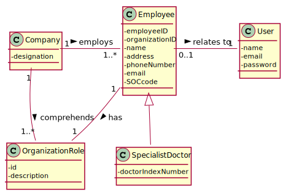

Notes:
- A grande novidade destas duas US prende-se com a necessidade de interligar com o componente "auth" de modo a que cada cliente/funcionário se torne também um utilizador do sistema.

De resto é bastante semelhante às restantes.

Para esta interligação, precisam:

Ler a documentação do componente "auth" e decidir a que objeto(s) e método(s) devem recorrer;
Atribuir a responsabilidade de interação a uma só classe (no âmbito de cada US)

Para o envio do email, é suficiente também mostrarem a classe a que atribuíram a responsabilidade de o fazer.

Saliento ainda que não devem confundir "UserRole" e "OrganizationRole".
Apesar de bastante semelhantes, não são a mesma coisa.

Por fim, saliento mais duas coisas:

Quando no âmbito de uma US é requerido/necessário estabelecer associações com objetos conhecidos do sistema, essa associação deve ser feita sempre por seleção (a partir de uma lista).
Após a seleção de objetos de uma lista na UI, a UI apenas deve/pode enviar os identificadores desses objetos para o Controller. Cabe depois à camada de dominio obter o respetivo objetivo a partir desse identificador.
# US 7 -  Specify a new employee

## 1. Requirements Engineering

### 1.1. User Story Description

As an administrator, I want to register a new employee.

### 1.2. Customer Specifications and Clarifications 

**From the Specifications Document:**
* **Outdated:** " All those who wish to use the application must be authenticated with a password holding seven alphanumeric characters, including three capital letters and two digits."
* **Updated specification (from client):** "The password should be randomly generated. It should have ten alphanumeric characters."

**From the client clarifications:**
* **Q: What kind of information does the company store about their employees?**
    * **A**: All the roles that exist in the Many Labs company are characterized by the following attributes:
      
      Employee ID;
      
      Organization Role;
      
      Name;
      
      Address;
      
      Phone Number;
      
      E-Mail;
      
      Standard Occupational Classification (SOC) code.

      The Specialist Doctor has an additional attribute:
      Doctor Index Number.
* **Q: How should the system respond in the event of creating a new user with the same attributes of an already existing user?**
    * **A**: This should be treated as an error. A subset of the attributes of any client are unique.
    
* **Q: And what attributes (...) will trigger this response?**
  * **A**: The e-mail address and phone number should be unique. The sex of each user is optional.
    
* **Q: When creating a new employee, the attributes "Employee ID" and "Doctor Index Number", are implemented by the administrator or incremented by the system?**
    * **A**: Only the employee ID should be generated from the initials of the employee name and should include a number. The number has 5 digits and is increases automatically when a new employee is registered in the system. For instance, if the company has 20 employees and wants to register a specialist doctor having the name Ana Maria Santos Moura, then the the employee ID for this specialist doctor should be AMSM00021.
    The Doctor Index Number should be introduced by the administrator.

* **Q: How are the passwords delivered to the users (client/employee)?**
    * **A**: Each users receives an e-mail informing that the registration was successful and that he can start to use the system. The e-mail includes the user password.

* **Q: When the application is delivered , should it have default employees , ex:administrator,etc.. , or should be completly empty (without any user or employee).**
    * **A**: One Administrator must be registered before starting the application for the first time.

* **Q: The apllication can add new employess but can it remove them , for exemple when one of them is fired ?**
    * **A**: For now I do not want such feature.

* **Q: Are there any other employee roles than the ones specified in the documents?**
    * **A**: No.

* **Q: Do these roles have different contracts with ManyLabs (i.e. temporary contract, permanent contract, freelance, etc...)? If so, should this be registered in the system together with the employee role information?**
    * **A**: Many Labs is known for making only permanent full-time contracts.Therefore, there is no need to register this type of information.

* **Q: Regarding the registration of a new employee, which is the organization role's format?**
    *   **A**: Organization Role: a string with no more than 15 characters.
### 1.3. Acceptance Criteria

* AC1: Each user must have a single role defined in the system. 
* AC2: Each employee must become also a system user/actor
* AC3: The "auth" component available on the repository must be reused (without
modifications).

### 1.4. Found out Dependencies

This US is dependent on "Specify a new organization Role", regarding:
* All organization Roles (class Role) are already created, as well as corresponding User Roles (class AuthFacade).
* User Role attribute "id" directly matches Organization Role "id".

### 1.5 Input and Output Data

**Input Data**
* **Typed data:** employee name, address, phone number and e-mail
* **Selected data:** employee role
* **Unclear:** employee ID, organization ID, SOC code, doctor index number

**Output Data**
* (In)Success of the operation

### 1.6. System Sequence Diagram (SSD)

### 1.7 Other Relevant Remarks

* **Special requirements:** None.
* **Data and/or technology variations:** None.
* **Frequency:** This US will happen several times during the application setup, in order to register all employess currently working at *Many Labs*. After the setup, it is expected to happen occasionally.

## 2. OO Analysis

### 2.1. Relevant Domain Model Excerpt

### 2.2. Other Remarks

*Use this section to capture some aditional notes/remarks that must be taken into consideration into the design activity. In some case, it might be usefull to add other analysis artifacts (e.g. activity or state diagrams).* 

## 3. Design - User Story Realization 

### 3.1. Rationale

**The rationale grounds on the SSD interactions and the identified input/output data.**

| Interaction ID | Question: Which class is responsible for... | Answer  | Justification (with patterns)  |
|:-------------  |:--------------------- |:------------|:---------------------------- |
| Step 1: starts a new employee registration | ... instantiating a new Employee? | Company | Creator: aggregates objects of Employee class |
| Step 2: requests employee role | ... returning the existent Roles? | Company | IE: knows all Role objects |
| Step 3: selects requested data | ... saving the input | Role | IE: knows its own data |
| Step 4: requests employee information | ... returning data necessary for each Role? | Employee Role | IE: Employee knows general data, Role knows specific data |
| Step 5: types requested data | ... saving the input? ...validating the data locally? ...validating the data globally? | Employee Employee/Role Company| IE: knows its own data IE: knows its own data IE: knows all Employee objects
| Step 6: shows the data and requests confirmation 		 |	N/A | |                              |
| Step 7: confirms the data | ... saving the new Employee? ... registering user account for new Employee? | Company AuthFacade | IE: adopts/records all Employee objects IE: knows/records all application users |
| Step 8: informs operation success | ... informing operation success? | UI | IE: Responsible for user interaction |

*Note: IE - Information Expert*

### Systematization ##

According to the taken rationale, the conceptual classes promoted to software classes are: 

 * Company
 * Employee
 * Role

Other software classes identified: 
 * CreateEmployeeUI (applying the Pure Fabrication pattern)  
 * CreateEmployeeController (applying the Pure Fabrication pattern)

## 3.2. Sequence Diagram (SD)

## 3.3. Class Diagram (CD)

# 4. Tests 
*In this section, it is suggested to systematize how the tests were designed to allow a correct measurement of requirements fulfilling.* 

**_DO NOT COPY ALL DEVELOPED TESTS HERE_**

**Test 1:** Check that it is not possible to create an instance of the Example class with null values. 

	@Test(expected = IllegalArgumentException.class)
		public void ensureNullIsNotAllowed() {
		Exemplo instance = new Exemplo(null, null);
	}

*It is also recommended to organize this content by subsections.* 

# 5. Construction (Implementation)

*In this section, it is suggested to provide, if necessary, some evidence that the construction/implementation is in accordance with the previously carried out design. Furthermore, it is recommeded to mention/describe the existence of other relevant (e.g. configuration) files and highlight relevant commits.*

*It is also recommended to organize this content by subsections.* 

# 6. Integration and Demo 

*In this section, it is suggested to describe the efforts made to integrate this functionality with the other features of the system.*

# 7. Observations

*In this section, it is suggested to present a critical perspective on the developed work, pointing, for example, to other alternatives and or future related work.*

