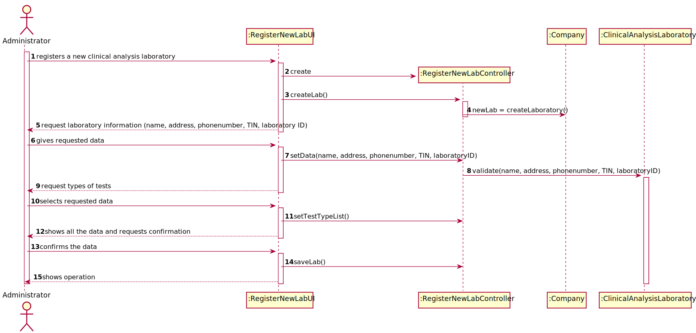
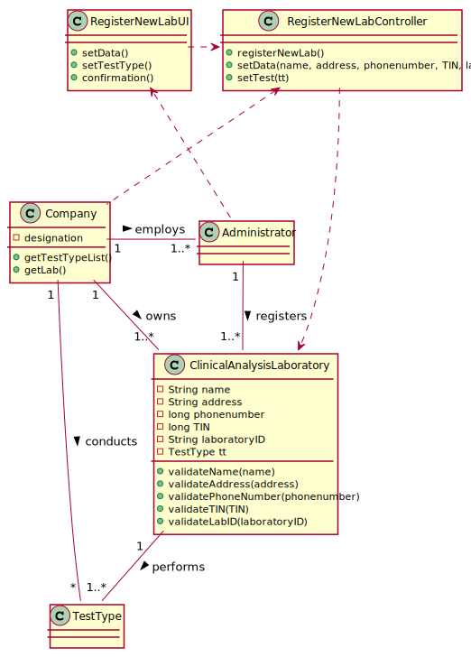

# US8 - Register a new clinical analysis laboratory

## 1. Engineering Requirements

### 1.1 User Story Description

As an **administrator**, I want to **register a new clinical analysis laboratory** stating which
kind of test(s) it operates.

### 1.2. Specifications and Clarifications

**From the client clarifications:**
* **Q:** What information is associated with a clinical Analysis laboratory (e.g. designation, localization...)? What rules are applicable to such data?
    * **A:** Each Clinical Analysis Laboratory is characterized by the following attributes:
        * Laboratory ID;
        * Name;
        * Address;
        * Phone Number;
        * TIN number.

* **Q:** Which type/format has LaboratoryID, address, name, phone number, and TIN number on Clinical Analysis Laboratory?
    * **A:** Each Clinical Analysis Laboratory is characterized by the following attributes:
         * Laboratory ID: five alphanumeric characters;
         * Name: A string with no more than 20 characters;
         * Address: A string with no more than 30 characters;
         * Phone Number: 11-digit number;
         * TIN number: 10-digit number;
         * Type of tests performed by the lab.
         
         All information is required.
         
### 1.3. Acceptance Criteria

* _**AC1**_ Laboratory's name must contain 20 characters or fewer.
* _**AC2**_ Laboratory's address should not have more than 30 characters.
* _**AC3**_ Laboratory's phone number must be an 11-digit number.
* _**AC4**_ Laboratory's TIN must be a 10-digit number.
* _**AC5**_ Laboratory ID must contain exactly 5 alphanumeric characters.

### 1.4. Found out Dependencies

There is a dependency to US9, before creating a new clinical analysis laboratory, the program needs to know what type of tests there exists.

### 1.5. Input and Output data
**Input data:**
- **Typed data:** Clinical Analysis Laboratory Name, Lab Address, Phone Number, Tax Identification Number, Laboratory ID
- **Selected data:** Types of Test

**Output data:**
- Success of the operation.

### 1.6. System Squence Diagram

## 2. OO Analysis

### 2.1. Relevant Domain Model Excerpt

### 2.2. Other Remarks

*Use this section to capture some additional notes/remarks that must be taken into consideration into the design activity. In some case, it might be usefull to add other analysis artifacts (e.g. activity or state diagrams).*

## 3. Design - User Story Realization 

### 3.1. Rationale

| Interaction ID | Question: Which class is responsible for... | Answer        | Justification (with patterns)  |
|:-------------  |:------------------------------------------  |:--------------|:------------------------------ |
| Step 1 | register a new clinical analysis laboratory? | Administrator| |
| Step 2 | request information about the new laboratory? | RegisterNewLabUI | |
| Step 3 | give the new laboratory information? | Administrator | |
| Step 4 | request type of tests performed by the lab? | RegisterNewLabUI | |
| Step 5 | select test types performed by the lab? | Administrator | |
| Step 6 | request for confirmation? | RegiterNewLabUI | |
| Step 7 | confirm all the data? | Administrator | |              

### Systematization ##

According to the taken rationale, the conceptual classes promoted to software classes are: 

 * ClinicalAnalysisLaboratory
 * TestType

Other software classes (i.e. Pure Fabrication) identified: 
 * RegisterNewLabUI  
 * RegisterNewLabController

## 3.2. Sequence Diagram (SD)

## 3.3. Class Diagram (CD)

# 4. Tests 

**Test 1:** Check that it is not possible to create an instance of the Example class with null values. 

	    @Test(expected = InvalidNameException.class)
        public void testEmptyName() {
            String name = "";
            ClinicalAnalysisLaboratory newLab = new ClinicalAnalysisLaboratory();
            newLab.setName(name);
        }

**Test 2:** Check that is not possible to create an instance over the character/digit limit for each parameter. This is also tested for the same 5 parameters.

    @Test(expected = InvalidNameException.class)
        public void testOver20CharacterName() {
            String name = "123456789012345678901";
            ClinicalAnalysisLaboratory newLab = new ClinicalAnalysisLaboratory();
            newLab.setName(name);
        }

# 5. Construction (Implementation)

        public void setData(String name, String address, long phonenumber, long TIN, String labID) {
            newlab.setName(name);
            newlab.setAddress(address);
            newlab.setPhoneNumber(phonenumber);
            newlab.setTIN(TIN);
            newlab.setLaboratoryID(labID);
        }
    
        public ArrayList<TestType> getTestTypeList() {
           return company.getTestTypeList();
        }
    
        public void setTestType(TestType tt){
            newlab.setTestTypeList(tt);
        }

# 6. Integration and Demo 

*In this section, it is suggested to describe the efforts made to integrate this functionality with the other features of the system.*

# 7. Observations

*In this section, it is suggested to present a critical perspective on the developed work, pointing, for example, to other alternatives and or future related work.*