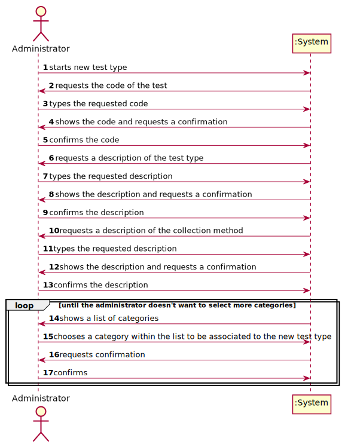
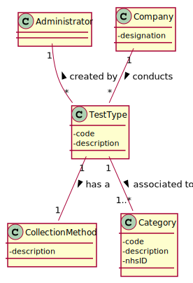
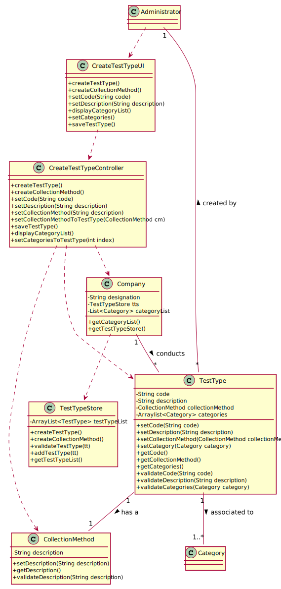

# US 9 - Define a new type of test and its collecting methods 

## 1. Requirements Engineering

### 1.1. User Story Description

*As an administrator, I want to specify a new type of test and its collecting methods.*

### 1.2. Customer Specifications and Clarifications 

**From the specifications document:**

>Such tests rely on measuring one or more parameters that can be grouped/organized by categories.
 
**From the client clarifications:**

In the US9 what do you mean by the collecting methods and  what collecting methods  are available??
>When the administrator (US9) specifies a new type of test, the administrator also specifies the method to collect a sample. The administrator introduces a brief description for each collecting method.

Should the collection method be associated to the test type or to the sample type?
>With the test type.

Does a type of test holds any attribute besides it's name and collecting methods?
>The attributes for a new test type are:
Code: five alphanumeric characters. The code is not automatically generated.
Description: a string with no more than 15 characters.
Collecting Method: a string with no more than 20 characters.
Each test type should have a set of categories. Each category should be chosen from a list of categories.
From a previous post: "Each category has a name and a unique code. There are no subcategories."

### 1.3. Acceptance Criteria

*AC1*: the code shouldn't have more than five alphanumeric characters.
*AC2*: the description of the test type should be a string with no more than 15 characters.
*AC3*: the collection method's description should be a string with no more than 20 characters.

### 1.4. Found out Dependencies

*There is a dependency to "US10 - Specifying a new parameter and categorizing it" since any type of test requires different parameters to be measured, which are grouped into categories.*

### 1.5 Input and Output Data

**Input Data:**

* Typed data:
    * a designation;
    * a description;
  
* Selected data:
    * a category, or more
  
**Output Data:**

* (In)Success of the operation.

### 1.6. System Sequence Diagram (SSD)

### 1.7 Other Relevant Remarks

>The administrator introduces a brief description for each collecting method.

## 2. OO Analysis

### 2.1. Relevant Domain Model Excerpt

### 2.2. Other Remarks

*Use this section to capture some aditional notes/remarks that must be taken into consideration into the design activity. In some case, it might be usefull to add other analysis artifacts (e.g. activity or state diagrams).* 

## 3. Design - User Story Realization 

### 3.1. Rationale

**The rationale grounds on the SSD interactions and the identified input/output data.**

| Interaction ID | Question: Which class is responsible for... | Answer  | Justification (with patterns)  |
|:-------------  |:--------------------- |:--------------------|:---------------------------- |
| Step 1 starts a new test type | instantiating a new test type? | TestTypeStore | Creator Pattern |
| Step 2 requests the data required (code, description and collection method's description) 		 | saving the input data?   validating the data locally?   validating the data globally? | TestType   TestType and Collection Method   TestTypeStore 	| IE: knows its own data   IE: knows its own data   IE: knows all TestType objects |                              |
| Step 3 requests the categories        | showing the category list?   saving the input categories? | Company   TestType | IE: Company knows all the categories   IE: knows its own data | 
| Step 4 confirms the data        |  saving the new Test Type? | TestTypeStore | IE: adopts/records all TestType objects |
| Step 5 informs operation success 		 |	informing operation success?						 | CreateTestTypeUI           | IE: Responsible for user interaction                          |

### Systematization ##

According to the taken rationale, the conceptual classes promoted to software classes are: 

 * TestType
 * Category
 * Company
 * CollectionMethod
 * Administrator
 * TestTypeStore

Other software classes (i.e. Pure Fabrication) identified: 
 * CreateTestTypeUI  
 * CreateTestTypeController

## 3.2. Sequence Diagram (SD)

*In this section, it is suggested to present an UML dynamic view stating the sequence of domain related software objects' interactions that allows to fulfill the requirement.* 

## 3.3. Class Diagram (CD)

*In this section, it is suggested to present an UML static view representing the main domain related software classes that are involved in fulfilling the requirement as well as and their relations, attributes and methods.*

# 4. Tests 
*In this section, it is suggested to systematize how the tests were designed to allow a correct measurement of requirements fulfilling.* 

**_DO NOT COPY ALL DEVELOPED TESTS HERE_**

**Tests related to the test type's code:**

**Test 1:** Check that it is not possible to set an empty code. 

	@Test(expected = InvalidCodeException.class)
    public void testEmptyTestTypeDesignation() {
        TestType test = new TestType();
        test.setCode("");
    }

**Test 2:** Check that it is not possible to set a code with more than 5 alphanumeric characters (according to the acceptance criteria).

    @Test(expected = InvalidCodeException.class)
    public void testTestTypeDesignationWithMoreThan5Characters() {
    TestType test = new TestType();
    test.setCode("yayaya");
    }

**Test 3:** Check that it is not possible to set a code with non-alphanumeric characters.

    @Test(expected = InvalidCodeException.class)
    public void testTestTypeDesignationWithNonAlphanumericCharacters() {
        TestType test = new TestType();
        test.setCode("asd!");
    }

The rest of the tests follow this exact same pattern, testing if it is possible to create an empty string or if it is possible to create objects that aren't according to the respective acceptance criteria.

# 5. Construction (Implementation)

*In this section, it is suggested to provide, if necessary, some evidence that the construction/implementation is in accordance with the previously carried out design. Furthermore, it is recommeded to mention/describe the existence of other relevant (e.g. configuration) files and highlight relevant commits.*

*It is also recommended to organize this content by subsections.* 

# 6. Integration and Demo 

*In this section, it is suggested to describe the efforts made to integrate this functionality with the other features of the system.*

# 7. Observations

*In this section, it is suggested to present a critical perspective on the developed work, pointing, for example, to other alternatives and or future related work.*

