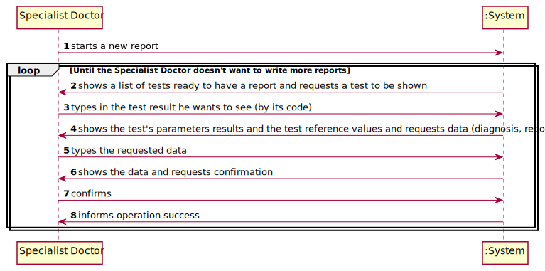
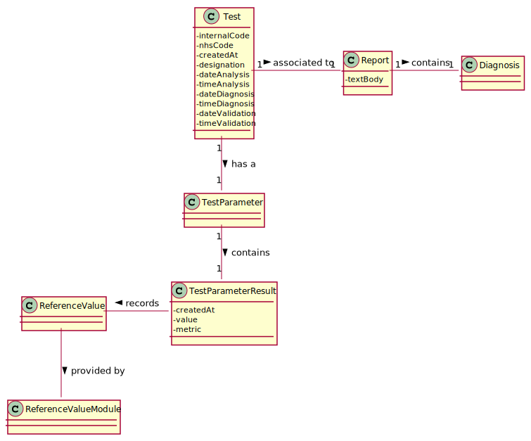

# US 14 - Creating a report as a Specialist Doctor

## 1. Requirements Engineering

### 1.1. User Story Description

*As a specialist doctor, I intend to make the diagnosis and write a report for a
given test*

### 1.2. Customer Specifications and Clarifications 

**From the specifications document:**

>After completing the chemical analysis, the results of all chemical analyses are analysed by a
specialist doctor who makes a diagnosis and writes a report that afterwards will be delivered to the
client.
To facilitate and simplify the validation work performed by the specialist doctor, the application
uses an external module that is responsible for doing an automatic validation using test reference
values.

**From the client's clarifications:**
* Q1: Is there a limit of characters for the report and the diagnosis that will be made by the Specialist Doctor?
> Yes, at most 400 words.
* Q2: Should the specialist doctor make the diagnosis and report at the same time? Or should he have the possibility to make one of them and, later, the other? (eg.: in case he needs to exit the application but has already worked on one of the two)
>
* Q3: Should the application have a specific order for the "documents" to be made by the specialist doctor? Or can he choose which one he wants to make first?
>
* Q4: Should the specialist doctor write the diagnosis and report in the application, or should he upload files written in another API?
>
* Q5: How should the specialist doctor choose the test to work on? By the indexes on a list with all the tests to validate, or by a specific parameter of the test (eg.: code)? In case he should do it by a specific parameter, which one should it be?
>
* Q6: Regarding the tests that the Specialist Doctor can write a report about: should the specialist doctor choose from a list of tests? Should he only receive a list of tests that have completed all of the previous steps?
> The system shows all tests ready (that have completed all the previous steps) to make the diagnosis and the Specialist Doctor selects one test. Then, the Specialist Doctor writes the report for the selected test.
* Q7: Once the specialist doctor decides to write the report for a given test, should the results of the chemical analysis and the reference values be presented on the screen? If not, how should the specialist doctor access the data related to the diagnosis he needs to make?
> After selecting a test (to make the diagnosis/report) the results of the chemical analysis and the reference values should be presented on the screen. Then the Specialist Doctor should write the report.
* Q8: While in the "Make a diagnosis and write a report" option of the main menu, should the specialist doctor be able to make a diagnosis and write a report for more than one test? Or does he need to exit and enter the "Make a diagnosis and write a report" option every time he wants to make a new diagnosis and write a new report?
> After writing a report the SD can choose to write other reports without leaving the use case.
* Q9: Can the Specialist Doctor edit a report once it has already been written? If yes, in what occasion should he be able to edit? Can he edit after the Laboratory Coordinator has already approved the report?
> No. No.
* Q10: Although it was not asked for, should we order the list of tests to be displayed by date of chemical analysis older to newer?
> Sorting is not required in this sprint.
* Q11: 
### 1.3. Acceptance Criteria

* AC1: The report should have a maximum of 400 words.

### 1.4. Found out Dependencies

*There is a dependency to US12 - "As a clinical chemistry technologist, I intend to record the results of a given test", since the Specialist Doctor needs to make the diagnosis and the report based on the results of a given test.*

### 1.5 Input and Output Data

**Input Data:**

* Typed data:
    * a diagnosis;
    * a report.
    

* Selected data:
    * test results;
    * test reference values;

**Output Data:**

* (In)Success of the operation.

### 1.6. System Sequence Diagram (SSD)

*Insert here a SSD depicting the envisioned Actor-System interactions and throughout which data is inputted and outputted to fulfill the requirement. All interactions must be numbered.*

### 1.7 Other Relevant Remarks

* **Special requirements**: None;
* **Data and/or technology variations**: None
* **Frequency**: This user story will be used every time there are new test results on the system. 

## 2. OO Analysis

### 2.1. Relevant Domain Model Excerpt 
*In this section, it is suggested to present an excerpt of the domain model that is seen as relevant to fulfill this requirement.* 

### 2.2. Other Remarks

*The diagnosis is part of the report and will be put somewhere on that report's text body.* 

## 3. Design - User Story Realization 

### 3.1. Rationale

**The rationale grounds on the SSD interactions and the identified input/output data.**

| Interaction ID | Question: Which class is responsible for... | Answer  | Justification (with patterns)  |
|:-------------  |:--------------------- |:------------|:---------------------------- |
| Step 1: starts a new report |	instantiating a new report?	| Test | Creator Pattern: Test contains an object from the Report class.  |                        
| Step 2: shows a list of tests ready to have a report and requests a test to be shown | having the list of tests? | TestStore | Information Expert: knows its own data. |
| Step 3: types in the test result he wants to see | saving the input? | CreateReportUI | Responsible for all the user-system interactions. |
| Step 4: shows the test's parameter result and test reference values and requests data (diagnosis, report) | n/a	| n/a | n/a |
| Step 5: types the requested data | saving the input? | Report | Information Expert: the object created in step 1 has its own data. |
| Step 6: shows the data and requests confirmation | validating the data locally? | Report , Diagnosis | Information Expert: knows its own data. |                                            
| Step 7: confirms | saving the report? | Test | Information Expert: records all the Report objects. |
| Step 8: informs operation success | informing operation success? | CreateReportUI | Responsible for all the user-system interactions. | 
### Systematization ##

According to the taken rationale, the conceptual classes promoted to software classes are: 

 * Test
 * Report

Other software classes (i.e. Pure Fabrication) identified: 
 * CreateReportUI  
 * CreateReportController

## 3.2. Sequence Diagram (SD)

*In this section, it is suggested to present an UML dynamic view stating the sequence of domain related software objects' interactions that allows to fulfill the requirement.* 

## 3.3. Class Diagram (CD)

*In this section, it is suggested to present an UML static view representing the main domain related software classes that are involved in fulfilling the requirement as well as and their relations, attributes and methods.*

# 4. Tests 
*In this section, it is suggested to systematize how the tests were designed to allow a correct measurement of requirements fulfilling.* 

**_DO NOT COPY ALL DEVELOPED TESTS HERE_**

**Test 1:** Check that it is not possible to create an instance of the Example class with null values. 

	@Test(expected = IllegalArgumentException.class)
		public void ensureNullIsNotAllowed() {
		Exemplo instance = new Exemplo(null, null);
	}

*It is also recommended to organize this content by subsections.* 

# 5. Construction (Implementation)

*In this section, it is suggested to provide, if necessary, some evidence that the construction/implementation is in accordance with the previously carried out design. Furthermore, it is recommeded to mention/describe the existence of other relevant (e.g. configuration) files and highlight relevant commits.*

*It is also recommended to organize this content by subsections.* 

# 6. Integration and Demo 

*In this section, it is suggested to describe the efforts made to integrate this functionality with the other features of the system.*

# 7. Observations

*In this section, it is suggested to present a critical perspective on the developed work, pointing, for example, to other alternatives and or future related work.*

