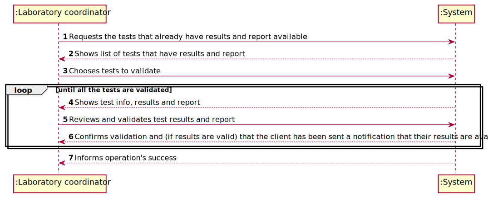

# US 15 - validate the work done by the clinical chemistry technologist and specialist doctor

## 1. Requirements Engineering

### 1.1. User Story Description

As a laboratory coordinator, I want to validate the work done by the clinical chemistry technologist and specialist doctor.

### 1.2. Customer Specifications and Clarifications

####From the specifications document

* "After the specialist doctor has completed the diagnosis, the results of the clinical analyses and the report become available in the system and must be validated by the laboratory coordinator."
* "To validate the work done, the laboratory coordinator checks the chemical test/result and associated diagnosis made and confirms that everything was done correctly."
* "Once the laboratory coordinator confirms that everything was done correctly, the client receives a notification alerting that the results are already available in the central application and informing that he/she must access the application to view those results."

####From the client clarifications

* **Q**: "Does the laboratory coordinator choose which client's results to validate?" **A**: ""
* **Q**: "Does the laboratory coordinator review the work of the specialist doctor and clinical chemical technologist's work separately or both at the same time?" **A**: ""
* **Q**: "Does the notification sent to client informing them that they have their results on the central application get sent automatically after the laboratory coordinator confirms the clinical chemistry technologist and specialist doctor's work?" **A**: ""

### 1.3. Acceptance Criteria

* Acceptance Criteria: The system does not show client personal information but shows all dates (test registration date, chemical analysis date and diagnosis date).

### 1.4. Found out Dependencies

* User story 15 is dependent on User story 12 considering the fact that the categorization of a new parameter requires the existance of a parameter category to include it in.
* User story 15 is dependent on User Story 14

### 1.5 Input and Output Data

* **Typed data:**
* **Selected data**

### 1.6. System Sequence Diagram (SSD)

### 1.7 Other Relevant Remarks

* **Special requirements**: None;
* **Data and/or technology variations**: None
* **Frequency**: This US will happen frequently throughout the application's lifetime, being used after every test's results come in.

## 2. OO Analysis

### 2.1. Relevant Domain Model Excerpt

## 3. Design - User Story Realization

### 3.1. Rationale

**The rationale grounds on the SSD interactions and the identified input/output data.**

| Interaction ID | Question: Which class is responsible for... | Answer  | Justification (with patterns)  |
|:-------------  |:---------------------|:------------|:---------------------------- |
| Step 1: Start a new parameter |	... instantiating a new Parameter? | Category | Creator: aggregates objects of Parameter class |
| Step 2: Shows list of parameter categories and asks to choose the one the new parameter falls under | ... getting the list of parameter categories available? | Company | IE: knows all the Category objects |
| Step 3: selects the parameter's category | ... setting the category? | CreateNewParameterController | Controller: saves instance of category |
| Step 4: Requests the data for the new parameter  | N/A |  |  |
| Step 5: Types in requested data | N/A |  |  |
| Step 6: Shows the data and asks for confirmation | N/A |  |  |
| Step 7: Confirms typed data | ... validating and saving the typed data? | Category | IE: knows its own parameters |
| Step 8: informs the operation's success | ... informing operations success? | CreateNewParameterUI | PF: responsible for user interaction |

### Systematization ##

According to the taken rationale, the conceptual classes promoted to software classes are:

* **Company**
* **Category**
* **Parameter**

Other software classes (i.e. Pure Fabrication) identified:
* CreateNewParameterUI
* CreateNewParameterController

## 3.2. Sequence Diagram (SD)

## 3.3. Class Diagram (CD)

# 4. Tests

**_DO NOT COPY ALL DEVELOPED TESTS HERE_**

**Test 1:** Check that it is not possible to create an instance of the Example class with null values.

	@Test(expected = InvalidNameException.class)
    public void testNullName(){
        String name = "";
        String code = "12345";
        String description = "Red blood cells";

        Parameter par = new Parameter(name, code, description);
    }

# 5. Construction (Implementation)

## Class CreateNewParameterController

    public void createNewParameter(String shortName, String code, String description) {
    this.par = this.pc.createNewParameter(shortName, code, description);
    }

# 6. Integration and Demo

# 7. Observations

*In this section, it is suggested to present a critical perspective on the developed work, pointing, for example, to other alternatives and or future related work.*

