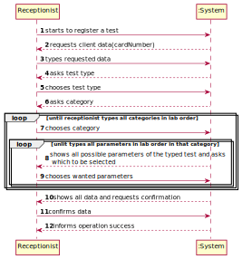
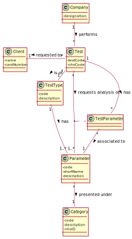
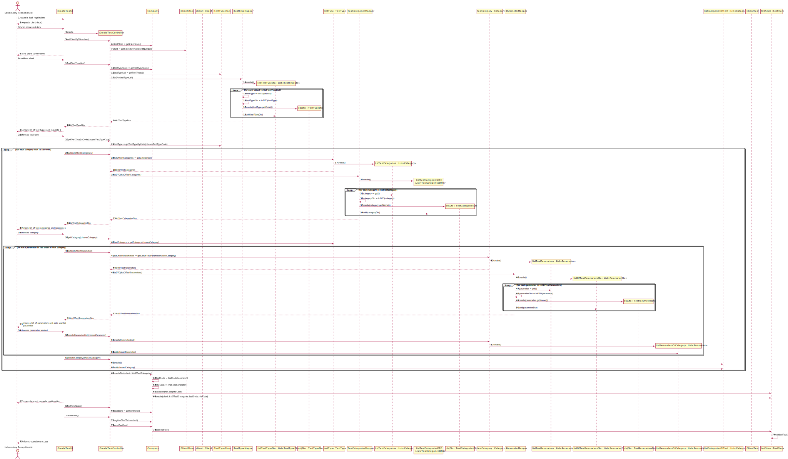
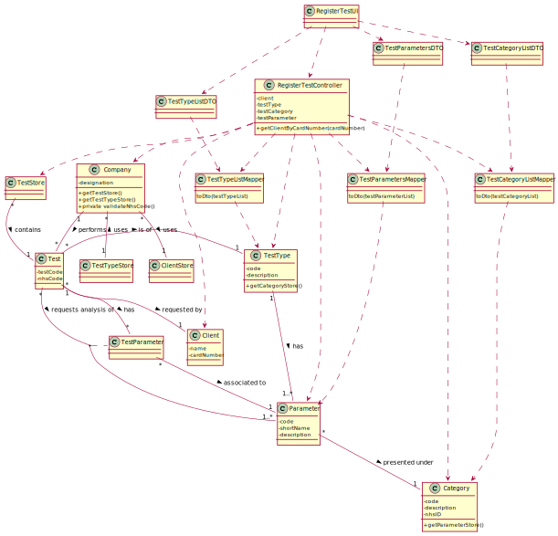

# US 4 - Register a Test to a Registered Client

## 1. Requirements Engineering

### 1.1. User Story Description

As a receptionist of the laboratory, I intend to register a test to be performed to a
registered client.

### 1.2. Customer Specifications and Clarifications 

**Customer Specifications**

Typically, the client arrives at one of the clinical analysis laboratories with a lab order prescribed by
a doctor. Once there, a receptionist asks the client’s citizen card number, the lab order (which
contains the type of test and parameters to be measured), and registers in the application the test to
be performed to that client.

**From the client clarifications:**

•	**Q1**: What are the necessary parameters according to the type of test?

**Answer:** "Each parameter is associated with one category. Each parameter has a Code, a Short Name and a Description. The Code are five alphanumeric characters. The Short Name is a String with no more than 8 characters. The Description is a String with no more than 20 characters."
            This answers your question? Moreover, you have US10 saying "As an administrator, I want to specify a new parameter and categorize it".

•	**Q2**: Other than the attributes already mentioned (test code, NHS code, designation) are there any other attributes that characterize a test?
            On those attributes, what requirements are there? For example, the characters on a designation, the code length, etc
          

**Answer:**  The test attributes are:

•	Test code : Sequential number with 12 digits. The code is automatically generated.
                      
•	NHS code: 12 alphanumeric characters. //AC ----
  
•	**Q3**: When the receptionist chooses the test type, should the categories appear, and then when selecting the category, the receptionist can choose the parameters for the test? Or when the Receptionist chooses the test type, should appear all the parameters that it includes immediately?

**Answer:**  Firstly, the receptionist should choose a test type. Then choose a category from a set of categories. Last, the receptionist should choose a parameter.

•	**Q3**: Since the Client has a Lab Order which contains the type of test and all the parameters to be measured, all the parameters selected by the Receptionist need to be equal to the Lab Order's parameters?

**Answer:** Yes.

•	Q4: Should we show the list of all clients available or just introduce the client's CCN ?
**Answer:**  The TIN number should be used to find a client and associate the client with the test.

### 1.3. Acceptance Criteria

**AC1** The receptionist must select the parameters to be analysed from
        all possible parameters in accordance with the test type.
        
**AC2** The receptionist must select the categories of the parameters to be chosen must be chosen from all possible categories for that test type 

### 1.4. Found out Dependencies

A receptionist must be already registered, revealing a dependence with US7.
There is a dependence with US3 as a Client must be already registered.
There is also a dependence with US9 and US10 since the receptionist must select the parameters available for a test.

### 1.5 Input and Output Data

*Identity here the data to be inputted by the system actor as well as the output data that the system have/needs to present in order to properly support the actor actions. Regarding the inputted data, it is suggested to distinguish between typed data and selected data (e.g. from a list)*

### 1.6. System Sequence Diagram (SSD)

### 1.7 Other Relevant Remarks

*Use this section to capture other relevant information that is related with this US such as (i) special requirements ; (ii) data and/or technology variations; (iii) how often this US is held.* 

## 2. OO Analysis

### 2.1. Relevant Domain Model Excerpt 
*In this section, it is suggested to present an excerpt of the domain model that is seen as relevant to fulfill this requirement.* 

### 2.2. Other Remarks

*Use this section to capture some aditional notes/remarks that must be taken into consideration into the design activity. In some case, it might be usefull to add other analysis artifacts (e.g. activity or state diagrams).* 

## 3. Design - User Story Realization 

### 3.1. Rationale

**The rationale grounds on the SSD interactions and the identified input/output data.**

| Interaction ID | Question: Which class is responsible for... | Answer  | Justification (with patterns)  |
|:-------------  |:--------------------- |:------------|:---------------------------- |
| Step 1  		 start a new test to a client|	instantiating a new test?	| Company | Creator Pattern: Company contains an object from the Test class           |
| Step 2 		 types in the card number of the client to register the test| saving the input?		 |RegisterTestUI|   Responsible for all the user-system interactions                           |
| Step 3  		 gets the client by the card number|returning the existing client?|ClientStore|  Information Expert: knows its own data                |
| Step 4  		 shows a list of all test types and requests a type to be chosen|returning the existing test types? 	| TestTypeStore|     Information Expert: knows its own data                        |
| Step 5  		 chooses the test type| saving the input? |RegisterTestUI|Responsible for all the user-system interactions                               |
| Step 6  		 shows a list of all categories and requests a category to be chosen |returning the existing categories? |TestType| Information Expert: knows all categories in that test type                          |
| Step 7  		 chooses the category wanted | saving the input?|RegisterTestUI| Responsible for all the user-system interactions     |              
| Step 8  		 shows a list of all parameters and request a parameter to be chosen|returning the existing parameters?|Category|Information Expert: knows all parameters of that category|              
| Step 9  		 chooses the parameters wanted| saving the input? validating the data locally? |Test|Information Expert: knows its own data   |              
| Step 10  		 confirms | saving the test?|Company |Information expert: records all the Test objects     |              
| Step 11  		 shows operation success|informing operation success? | RegisterTestUI|  Responsible for all the user-system interactions                  |              

### Systematization ##

According to the taken rationale, the conceptual classes promoted to software classes are: 

 * Test
 * Company

Other software classes (i.e. Pure Fabrication) identified: 
 * CreateTestUI  
 * CreateTestController

## 3.2. Sequence Diagram (SD)

## 3.3. Class Diagram (CD)

*In this section, it is suggested to present an UML static view representing the main domain related software classes that are involved in fulfilling the requirement as well as and their relations, attributes and methods.*

# 4. Tests 
*In this section, it is suggested to systematize how the tests were designed to allow a correct measurement of requirements fulfilling.* 

**_DO NOT COPY ALL DEVELOPED TESTS HERE_**

**Test 1:** Check that it is not possible to create an instance of the Example class with null values. 

	 @org.junit.Test(expected = IllegalArgumentException.class)
        public void ensureNullIsNotAllowed() {
            Test test = new Test(null, null,null,null);
        }

*It is also recommended to organize this content by subsections.* 

# 5. Construction (Implementation)

*In this section, it is suggested to provide, if necessary, some evidence that the construction/implementation is in accordance with the previously carried out design. Furthermore, it is recommeded to mention/describe the existence of other relevant (e.g. configuration) files and highlight relevant commits.*

*It is also recommended to organize this content by subsections.* 

# 6. Integration and Demo 

*In this section, it is suggested to describe the efforts made to integrate this functionality with the other features of the system.*

# 7. Observations

*In this section, it is suggested to present a critical perspective on the developed work, pointing, for example, to other alternatives and or future related work.*

