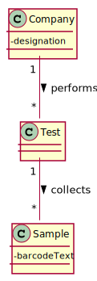

# US5 - Record collected samples in the scope of a given test

## 1. Requirements Engineering

### 1.1. User Story Description

_As a **medical lab technician**, I want to **record the samples collected in
the scope of a given test.**

### 1.2. Customer Specifications and Clarifications 

**From the Specifications Document:**
>"...the client should wait until a medical lab technician calls him/her
 to collect the samples required to perform a given test."

>"All the tests (clinical blood tests and Covid-19 tests) performed by the network of laboratories are
  registered locally by the medical lab technicians who collect the samples."

>"When sampling (blood or swab) the medical lab technician records the samples in the system,
  associating the samples with the client/test, and identifying each sample with a barcode that is
  automatically generated using an external API."

**From the client clarifications**:

* **Q1**: What kind of attributes should a sample have?
    * **A**: Each sample is associated with a test. A sample has only one attribute, a barcode number (UPC) that is a sequential number and is automatically generated by the system. Each sample has a unique barcode number.
    In US5, the medical lab technician checks the system and see all tests for which there are no samples collected. The medical lab technician selects a test and the system asks for the number of samples to collect.

* **Q2**: Can a test have more than one sample?
    * **A**: Yes.
    
    
* **Q3**: We didn't fully understand what will the API do in this US, so here's out interpretation from the US, correct us if we're wrong please: The API will be generated randomly and the API is an attribute from the sample.
    * **A**: The API will be used to generate/print barcodes.

* **Q4**: In the US acceptance criteria, it's also said that: "The API to use is defined by configuration.", does this means the medical lab technician is the one who chooses which kind of API wants to use for a certain sample?
    * **A**: No. You should study ESOFT to answer this question.
    
    
* **Q5**: What information does the medical lab technician needs to input to record a new sample?
    * **A**: The medical lab technician checks a list of tests and selects one. Then, the application generates barcodes (one or more). After printing the barcodes (one or more) the use case ends.

* **Q6**: During the current sprint, how should we allow the barcodes to be printed. After generating them via the API, should we save the barcode images to the disk?
  * **A** : Each generated barcode should be saved in a folder as a jpeg file.

* **Q7**: It was answered in one of the previous questions that the sample only has one attribute, the barcode, however the description of the project also mentions a date of collection of the samples, is this date supposed to be an attribute of the test and not of the sample itself?
  * **A**: Yes. The system should record the date (DD/MM/YYYY) and time (HH:MM) when the sample is collect made. The date and time are automatically generated by the system when the barcode is issued.

* **Q8**: If there were multiple samples for a single test, would there be only one collection date for all of them?
  * **A**: Only one collection date and time for a test.
  

* **Q9**: Why is there the specification for only the tests with no samples?
  * **A**: The Medical Lab Technician selects a tests and the number of barcodes he/she wants. Then the system generates the requested barcodes.
  After generating the barcodes, the select test is no more available in the system for generating barcodes.
    

* **Q10**: Shouldn't there be a way for technicians to add more samples to an existing test?
  * **A**: No.

* **Q11**: Should there be a validation of the number of samples?
  * **A**: No.
  

### 1.3. Acceptance Criteria

* **AC1**: The system should support several barcode APIs. The API to use is
defined by configuration.
* **AC2**: One test can have more than a sample.
* **AC3**: Each barcode generated must be saved in a folder as a .jpeg file. 

### 1.4. Found out Dependencies

* **US4**: Tests list needed to associate samples to a performed test.

### 1.5 Input and Output Data

**Input data:**
* **Typed data:** Number of Samples
* **Selected data:** Test Type

**Output data:**
- Test Type List
- (In)Success of operation.

### 1.6. System Sequence Diagram (SSD)

### 1.7 Other Relevant Remarks

*Use this section to capture other relevant information that is related with this US such as (i) special requirements ; (ii) data and/or technology variations; (iii) how often this US is held.* 

## 2. OO Analysis

### 2.1. Relevant Domain Model Excerpt 

### 2.2. Other Remarks

*Use this section to capture some aditional notes/remarks that must be taken into consideration into the design activity. In some case, it might be usefull to add other analysis artifacts (e.g. activity or state diagrams).* 

## 3. Design - User Story Realization 

### 3.1. Rationale

**The rationale grounds on the SSD interactions and the identified input/output data.**

| Interaction ID | Question: Which class is responsible for... | Answer  | Justification (with patterns)  |
|:-------------  |:--------------------- |:------------|:---------------------------- |
| Step 1 - Request to record new collected sample(s) | instantiating a new collected sample? | Medical Lab Technician|                              |
| Step 2 - Shows list of tests| storing the available tests? | TestStore |                              |
| Step 3 - Select test| choose the performed test? | Medical Lab Technician |                              |
| Step 4 - Request number of samples to record |  |             |                              |
| Step 5 - Give number of samples to record |							 |             |                              |
| Step 6 - Request confirmation |							 |             |                              |              
| Step 7 - Give confirmation |							 |             |                              |              
| Step 8 - Show (in)success of operation |							 |             |                              |              

### Systematization ##

According to the taken rationale, the conceptual classes promoted to software classes are: 

 * Class1
 * Class2
 * Class3

Other software classes (i.e. Pure Fabrication) identified: 
 * SampleUI  
 * SampleController

## 3.2. Sequence Diagram (SD)

## 3.3. Class Diagram (CD)

# 4. Tests 
*In this section, it is suggested to systematize how the tests were designed to allow a correct measurement of requirements fulfilling.* 

**_DO NOT COPY ALL DEVELOPED TESTS HERE_**

**Test 1:** Check that it is not possible to create an instance of the Example class with null values. 

	@Test(expected = IllegalArgumentException.class)
		public void ensureNullIsNotAllowed() {
		Exemplo instance = new Exemplo(null, null);
	}

*It is also recommended to organize this content by subsections.* 

# 5. Construction (Implementation)

*In this section, it is suggested to provide, if necessary, some evidence that the construction/implementation is in accordance with the previously carried out design. Furthermore, it is recommeded to mention/describe the existence of other relevant (e.g. configuration) files and highlight relevant commits.*

*It is also recommended to organize this content by subsections.* 

# 6. Integration and Demo 

*In this section, it is suggested to describe the efforts made to integrate this functionality with the other features of the system.*

# 7. Observations

*In this section, it is suggested to present a critical perspective on the developed work, pointing, for example, to other alternatives and or future related work.*