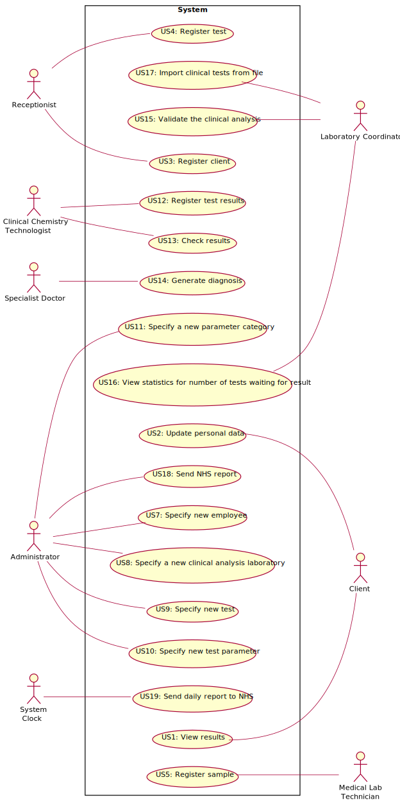

# Use Case Diagram (UCD)

**In the scope of this project, there is a direct relationship of _1 to 1_ between Use Cases (UC) and User Stories (US).**

# Use Cases / User Stories
| UC/US  | Name | Actor | Description                   
|:----|:------------------------------------------------------------------------|:---|:----|
| US1 | [Generate NHS report](US1/US1.md) | System Clock | NHS requires automatic information about the number of COVID-19 tests performed, and to report the number of positive cases per day, week, month and year, generate forecasts and generate daily reports. |
| US2 | [View results](US2/US2.md) | Client  | Notify by SMS and e-mail when results are available. Display the results. |
| US3 | [Register client](US3/US3.md)| Receptionist | Register a new client in the application (required client’s citizen card number, NHS number, birth date, sex, TIF, phone number, e-mail and name. |
| US4 | [Register test](US4/US4.md)| Receptionist | Register in the application the test to be performed to a registered client. |
| US5 | [Register sample](US5/US5.md)| Medical Lab Technician | Record the sample in the system, associating the samples with the client/test, and identifying each sample with a barcode. |
| US6 | [View statistics for number of tests waiting for result](US6/US6.md) | Lab Coordinator | Compute the time interval, in a week, when the company was less effective in responding. |
| US7 | [Specify a new employee](US7/US7.md) | Administrator | Register a new employee in the application. |
| US8 | [Specify a new clinical analysis laboratory](US8/US8.md) | Administrator | Register a new clinical analysis laboratory in the application and state what kind of tests it operates. |
| US9 | [Specify new test](US9/US9.md) | Administrator | Specify a new type of test and its collecting methods. |
| US10 | [Specify new test parameter](US10/US10.md) | Administrator | Specify a new test parameter and categorize it. |
| US11 | [Specify a new parameter category](US11/US11.md) | Administrator | Specify a new test parameter category. |
| US12 | [Register test results](US12/US12.md)| Clinical Chemistry Technologist | Record the results of the chemical analysis on the samples. |
| US13 | [Check results](US13/US13.md) | Medical Lab Technician, Clinical Chemistry Technologist, Specialist Doctor, Laboratory Coordinator | Display the result information to all actors. |
| US14 | [Generate diagnosis](US14/US14.md) | Specialist Doctor | The results of all chemical analysis are automatically validated using test reference values. The doctor makes a diagnosis with that information and writes a report to deliver to the client. |
| US15 | [Validate the clinical analysis](US15/US15.md) | Laboratory Coordinator | Display the chemical test/result and associated diagnosis for validation. |
