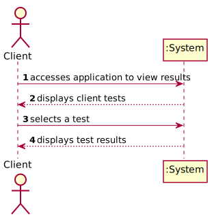
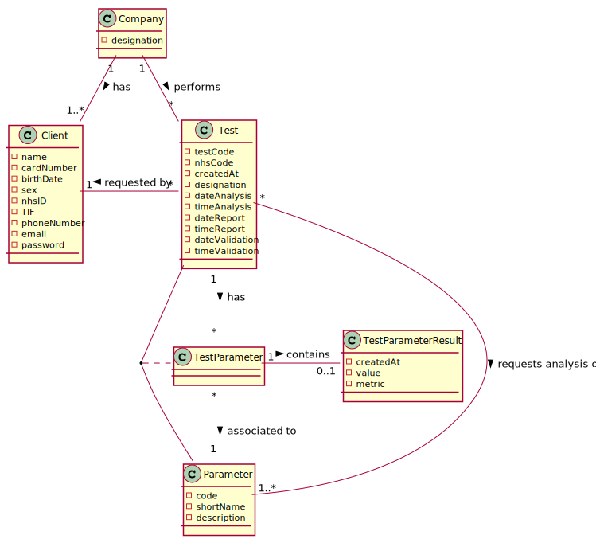
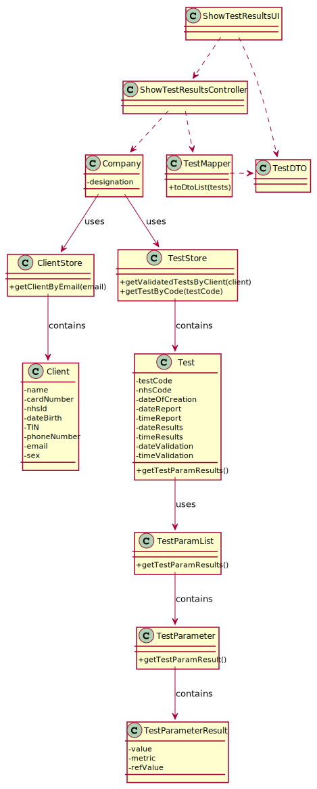

# US 1 -  View results of the tests

## 1. Requirements Engineering

### 1.1. User Story Description

As a client, I want to access the application to view the results of the tests I have performed.

### 1.2. Customer Specifications and Clarifications 

**From the Specifications Document:**

* Once the laboratory coordinator confirms that everything was done correctly, the client receives a notification alerting that the results are already available in the central application and informing that he/she must access the application to view those results.

**From the client clarifications:**
* **Q: In US01 which date should be used to arrange the tests in order?The date the test is done or the validation date?**
  
  **A:** The test registration date.

### 1.3. Acceptance Criteria

* **AC1:** The client tests must be shown ordered from the most recent to the oldest one.
* **AC2:** The test results are shown only after the client has selected a test.

### 1.4. Found out Dependencies

* **US15:** Validate the work done by the CCT and SD.
* **US3:** Register a client.

### 1.5 Input and Output Data

**Input Data**
* **Typed data:** none
* **Selected data:** test

**Output Data**
* Test results

### 1.6. System Sequence Diagram (SSD)

### 1.7 Other Relevant Remarks

* **Special requirements:** Graphical user interface.
* **Data and/or technology variations:** None.
* **Frequency:** This US will happen several times.

## 2. OO Analysis

### 2.1. Relevant Domain Model Excerpt

### 2.2. Other Remarks

*Use this section to capture some aditional notes/remarks that must be taken into consideration into the design activity. In some case, it might be usefull to add other analysis artifacts (e.g. activity or state diagrams).* 

## 3. Design - User Story Realization 

### 3.1. Rationale

**The rationale grounds on the SSD interactions and the identified input/output data.**

| Interaction ID | Question: Which class is responsible for... | Answer  | Justification (with patterns)  |
|:-------------  |:--------------------- |:------------|:---------------------------- |
|**2. displays client tests**| ...knowing the client? | AuthFacade Company ClientStore| IE: Auth knows the e-mail of the logged in client   IE: Company knows all clients   HCLC: All clients are stored in the Client Store.|
| | ...knowing the client tests? | Company TestStore | IE: Company knows all tests HCLC: All tests are stored in the TestStore |
| | ...displaying the client tests? | ShowTestResultsUI | PF: There is no reason to assign this responsibility to any existing class in the Domain Model |
|**3. displays test results** | ...knowing the clients tests results? | TestParameter TestParamList | IE: TestParameter knows its own result HCLC: TestParamList stores all TestParameters in a test |
| | ...displaying test results? | ShowTestResultsUI | PF: There is no reason to assign this responsibility to any existing class in the Domain Model |
*Note: IE - Information Expert   HCLC - High Cohesion Low Coupling   PF: Pure Fabrication*

### Systematization ##

According to the taken rationale, the conceptual classes promoted to software classes are: 

 * AuthFacade
 * Company
 * TestStore
 * TestParameter
 * TestParamList

Other software classes identified: 
 * ShowTestResultUI (applying the Pure Fabrication pattern)  
 * ShowTestResultController (applying the Pure Fabrication pattern)

## 3.2. Sequence Diagram (SD)

## 3.3. Class Diagram (CD)

# 4. Tests 

# 5. Construction (Implementation)

# 6. Integration and Demo 

# 7. Observations

