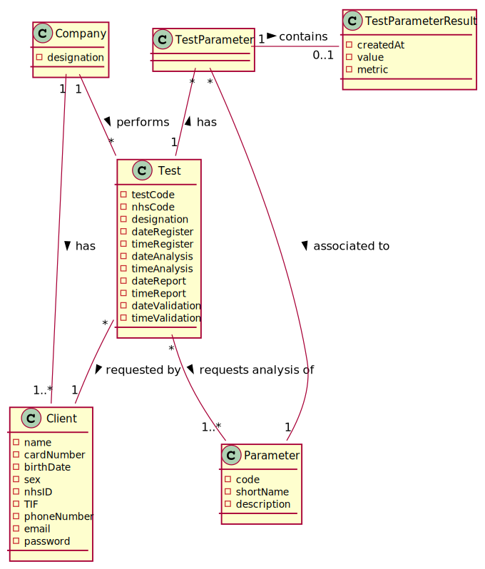
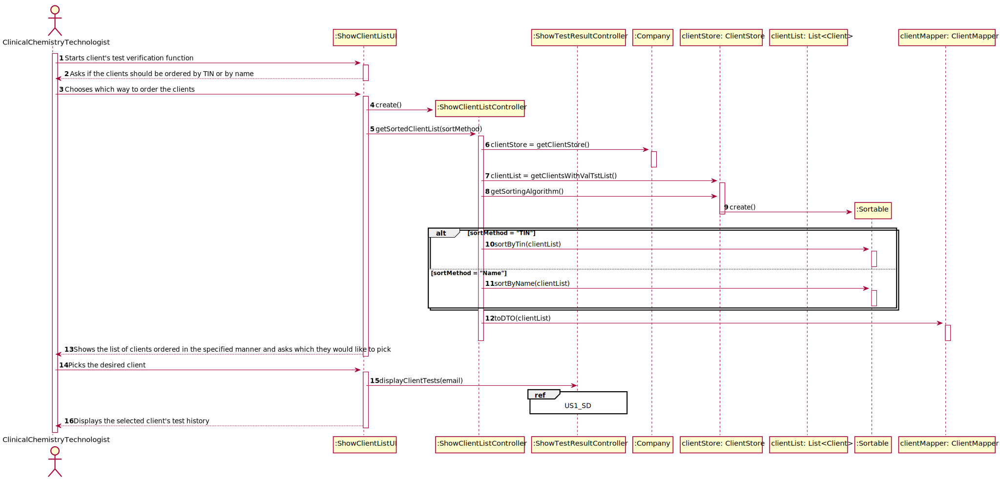
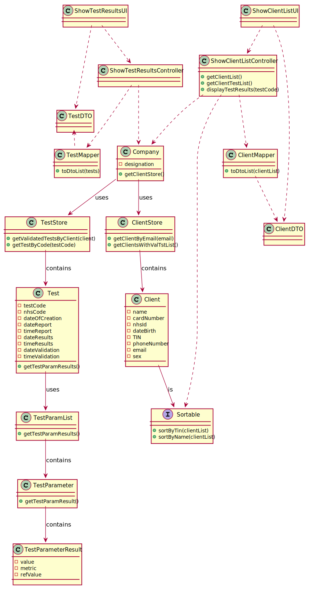

# US 13 - Consulting historical tests performed by a particular client

## 1. Requirements Engineering

### 1.1. User Story Description

As a clinical chemistry technologist, I intend to consult the historical tests performed by a particular client and to be able to check tests details/results.

### 1.2. Customer Specifications and Clarifications

####From the specifications document

* "To facilitate the access to the results, the application must allow ordering the clients by TIF and by name. The ordering algorithm to be used by the application must be defined through a configuration file. It is intended that the choice of the ordering algorithm is based on the algorithm complexity (mainly the execution time). Therefore, at least two sorting algorithms should be evaluated and documented in the application user manual (in the annexes) that must be delivered with the application."

####From the client clarifications

* **Q1**: "What information does the clinical chemistry technologist have access to?" **A**: "The clinical chemistry technologist should be able to check the historical tests performed by a particular client and see the **results** obtained in each test. For a given client (that was selected by the clinical chemistry technologist) the application should show all tests performed by the client and, for each parameter, the application should **show the parameter value and the parameter reference values**. The clinical chemistry technologist should not have access to the report made by the specialist doctor."

* **Q2**: "Can the clinical chemistry technologist alter any of the test details/results?" **A**: ""

* **Q3**: "The client's tests, that we have to show on this US, need to have been validated by the lab coordinator or is it enough if they just have results and we can show them before being validated by the lab coordinator?" **A**: "The tests to be presented in US13 are tests that have **already been validated** by the lab coordinator."

### 1.3. Acceptance Criteria

* AC1: The application must allow ordering the clients by TIN and by name to help the clinical chemistry technologist choose the target client. The ordering algorithm to be used by the application must be defined through a configuration file. At least two sorting algorithms should be available.

### 1.4. Found out Dependencies

### 1.5 Input and Output Data

* **Input data** - Typed data: N/A ; Selected Data: Client
* **Output data** - All clients with tests validated in the system, Client's validated test history (Results: Parameter value and parameter reference values)

### 1.6. System Sequence Diagram (SSD)

### 1.7 Other Relevant Remarks

* **Special requirements**: None;
* **Data and/or technology variations**: None
* **Frequency**: This US will happen sporadically during the application's lifetime.

## 2. OO Analysis

### 2.1. Relevant Domain Model Excerpt

## 3. Design - User Story Realization

### 3.1. Rationale

**The rationale grounds on the SSD interactions and the identified input/output data.**

| Interaction ID | Question: Which class is responsible for... | Answer  | Justification (with patterns)  |
|:-------------  |:---------------------|:------------|:---------------------------- |
| Step 1: Starts client's test verification function | N/A |  |  |
| Step 2: Asks if the clients should be ordered by TIN or by name | N/A |  |  |
| Step 3: Chooses which way to order the clients | ... sorting the clients by the selected parameter? | SortingAlgorithm |  |
| Step 4: Shows the list of clients ordered in the specified manner and asks which they would like to pick  | ... showing the list of clients? | TestConsultationUI | Pure Fabrication |
| Step 5: Picks the desired client | ... getting the client's test ? | TestStore | High cohesion/Low coupling |
| Step 6: Displays the selected client's test history |  |  |  |
| Step 7: Displays test results |  |  |  |

### Systematization ##

According to the taken rationale, the conceptual classes promoted to software classes are:

* 

Other software classes (i.e. Pure Fabrication) identified:
* 
* 

## 3.2. Sequence Diagram (SD)

## 3.3. Class Diagram (CD)

# 4. Tests

**_DO NOT COPY ALL DEVELOPED TESTS HERE_**

# 5. Construction (Implementation)

# 6. Integration and Demo

# 7. Observations

*In this section, it is suggested to present a critical perspective on the developed work, pointing, for example, to other alternatives and or future related work.*

