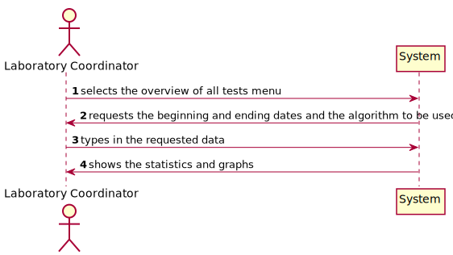
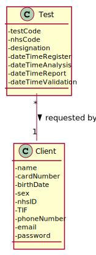

# US 16 - Having an overview of all the tests performed by Many Labs

## 1. Requirements Engineering

### 1.1. User Story Description

As a laboratory coordinator, I want to have an overview of all the tests performed by Many Labs and analyse the overall performance of the company (for instance, check the sub-intervals in which there were more samples waiting for the result). To facilitate overall analysis, the application should also display statistics and graphs.

### 1.2. Customer Specifications and Clarifications 

**From the specifications document:**

Moreover, Many Labs is a company that needs to be continuously evaluating and improving its
internal processes to achieve excellence and to beat the competition. Therefore, the company wants
to decrease the number of tests waiting for its result. To evaluate this, it proceeds as following: for
any interval of time, for example one week (6 working days with 12 working hours per day), the
difference between the number of new tests and the number of results available to the client during
each half an hour period is computed. In that case, a list with 144 integers is obtained, where a
positive integer means that in such half an hour more tests were processed than results were
obtained, and a negative integer means the opposite. Now, the problem consists in determining what
the contiguous subsequence of the initial sequence is, whose sum of their entries is maximum. This
will show the time interval, in such week, when the company was less effective in responding. So,
the application should implement a brute-force algorithm (an algorithm which examines each
subsequence) to determine the contiguous subsequence with maximum sum, for any interval of time
registered. The implemented algorithm should be analysed in terms of its worst-case time
complexity, and it should be compared to a provided benchmark algorithm. The algorithm to be
used by the application must be defined through a configuration file.
The complexity analysis must be accompanied by the observation of the execution time of the
algorithms for inputs of variable size in order to observe the asymptotic behaviour. The time
complexity analysis of the algorithms should be properly documented in the application user
manual (in the annexes) that must be delivered with the application.

**From the client's clarifications:**

* Q1: On the project description is written that "The algorithm to be used by the application must be defined through a configuration file", but on the requirements is written that "the laboratory coordinator should have the ability to dynamically select the algorithm to be applied from the ones available on the system". Should we discard the configuration file and add an option on the program to select one of the available algorithms?
> Developing an application, like the one we are developing during the Integrative Project, is a dynamic process and the best teams are those who are prepared to react to change quickly. Moreover, the latest client requests/requirements are those that should be considered. Typically, a client updates the requirements throughout the project development.
Please consider the requirements introduced at the beginning of Sprint D. The laboratory coordinator should have the ability to dynamically select the algorithm to be applied from the ones available on the system (either the benchmark algorithm provided in moodle or the brute-force algorithm to be developed by each team).

* Q2: Should the interval of time considered for the evaluation be asked to the Laboratory Coordinator?
> Yes.

* Q3: How should we ask him the interval of time to be considered? Should we ask him to type a number of days? A number of weeks? Should we give general options like: last week, last month..., for him to select from?
> The laboratory coordinator should introduce two dates that define an interval, the beginning date and the end date. This interval will be used to find the contiguous subsequence with maximum sum.

* Q4: What is the meaning of "overview" here? Should the laboratory coordinator see the number of tests waiting for samples, the number of tests waiting for results, the number of tests waiting for diagnosis... Or should he see the information available for each one of the tests in the application?
> The laboratory coordinator should be able to check the number of clients, the number of tests waiting for results, the number of tests waiting for diagnosis and the total number of tests processed in the laboratory in each day, week, month and year. Moreover, the laboratory coordinator should be able to check the contiguous subsequence with maximum sum.

* Q5: Regarding US16, when the laboratory coordinator "analyses the overall performance of the company", is the analysis purely looking at the results? Or should he write any type of report based on the results for the interval he is seeing?
> You should only identify the time interval where there was a delay in the response (the maximum subsequence).

* Q6: Does the laboratory coordinator also select the amount of working hours per day? Or should we just consider it as 12 working hours/day?
> The lab coordinator does not select the amount of working hours per day. Please consider 12 working hours per day.

* Q7: When referring to "the application should also display statistics and graphs" is it up to the team to decide which API or resource should be used to generate graphs and statistics, or do you prefer something specific?
> With JavaFX you can draw high quality graphs and there is no need to use other tools.

* Q8: What are the statistics that require a graph?
> In a previous post I asked: "The laboratory coordinator should be able to check the number of clients, the number of tests waiting for results, the number of tests waiting for diagnosis and the total number of tests processed (tests validated) in the laboratory in each day, week, month and year. The system should show these statistics for a given interval that should be selected/defined by the user".
The application should present these statistics using four graphs/charts, one for each time resolution (day, week, month and year).

In a previous post I also said: "Moreover, the application should also show to the laboratory coordinator the total number of clients and the total number of validated tests that exist in the system.". There is no need to show these information using a graph/chart.
### 1.3. Acceptance Criteria

* AC1: While evaluating the performance, the laboratory
  coordinator should have the ability to dynamically select the algorithm to be
  applied from the ones available on the system (the benchmark algorithm provided
  in moodle and the brute-force algorithm to be developed). Support for easily
  adding other similar algorithms is required.
  
* AC2: The laboratory coordinator has to select the beginning date and the end date for the interval of time.

* AC3: The both dates selected must be before the day the laboratory coordinator is in.

### 1.4. Found out Dependencies

This user story depends on the following user stories: 
* US14: registering a test to be performed by a client;
* US12: recording the results of a given test.

### 1.5 Input and Output Data

**Input Data:**

* Typed data:
  * the beginning and ending dates.

* Selected data:
  * the algorithm (either the brute force algorithm or the benchmark algorithm).

**Output Data:**

* Statistics and graphs;
* (In)Success of the operation.

### 1.6. System Sequence Diagram (SSD)

### 1.7 Other Relevant Remarks

* There aren't any relevant remarks.

## 2. OO Analysis

### 2.1. Relevant Domain Model Excerpt 

### 2.2. Other Remarks

* None.

## 3. Design - User Story Realization 

### 3.1. Rationale

**The rationale grounds on the SSD interactions and the identified input/output data.**

| Interaction ID | Question: Which class is responsible for... | Answer  | Justification (with patterns)  |
|:-------------  |:--------------------- |:------------|:---------------------------- |
| Step 1: selects the overview of all tests menu | interacting with the user? | OverviewTestsUI | Pure Fabrication |
| Step 2: requests the beginning and ending dates and the algorithm to be used |							 |             |                              |
| Step 3: types in the requested data |							 |             |                              |
| Step 4: shows the statistics and graphs  		 |							 |             |                             |

### Systematization ##

According to the taken rationale, the conceptual classes promoted to software classes are: 

 * Class1
 * Class2
 * Class3

Other software classes (i.e. Pure Fabrication) identified: 
 * OverviewTestsUI (applying the “pure fabrication” pattern)
 * OverviewTestsController (applying the “controller” pattern)

## 3.2. Sequence Diagram (SD)

*In this section, it is suggested to present an UML dynamic view stating the sequence of domain related software objects' interactions that allows to fulfill the requirement.* 

## 3.3. Class Diagram (CD)

*In this section, it is suggested to present an UML static view representing the main domain related software classes that are involved in fulfilling the requirement as well as and their relations, attributes and methods.*

# 4. Tests 
*In this section, it is suggested to systematize how the tests were designed to allow a correct measurement of requirements fulfilling.* 

**_DO NOT COPY ALL DEVELOPED TESTS HERE_**

**Test 1:** Check that it is not possible to create an instance of the Example class with null values. 

	@Test(expected = IllegalArgumentException.class)
		public void ensureNullIsNotAllowed() {
		Exemplo instance = new Exemplo(null, null);
	}

*It is also recommended to organize this content by subsections.* 

# 5. Construction (Implementation)

*In this section, it is suggested to provide, if necessary, some evidence that the construction/implementation is in accordance with the previously carried out design. Furthermore, it is recommeded to mention/describe the existence of other relevant (e.g. configuration) files and highlight relevant commits.*

*It is also recommended to organize this content by subsections.* 

# 6. Integration and Demo 

*In this section, it is suggested to describe the efforts made to integrate this functionality with the other features of the system.*

# 7. Observations

*In this section, it is suggested to present a critical perspective on the developed work, pointing, for example, to other alternatives and or future related work.*

