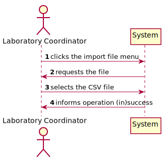

# US 17 - Importing clinical tests from a CSV file.

## 1. Requirements Engineering

### 1.1. User Story Description

As a laboratory coordinator, I want to import **clinical tests** from a CSV file.

### 1.2. Customer Specifications and Clarifications 

**From the specifications document:**

There is nothing in the specifications document referring to this user story.

**From the client's clarifications:**

* Q1: In what folder should the CSV file be when we want to use the application through the console?
> In this sprint each team should develop a graphical user interface. The file to import can be located in any folder. The user should specify the path of the file.

* Q2: In the CSV files provided for this sprint we can find a parameter with code HDL00 which belongs to the Cholesterol category and to the blood test type, but by searching the external modules for the blood test type the team could not find a match for the said parameter. What can we as a team do to resolve such issue?
> If the API does not have reference values for this parameter, than you should not present the reference values to the application user.

* Q3: Will the CSV files always have the same format as the ones available on moodle?
> Yes. But we can have more categories and parameters for each type of test.

* Q4: Should the tests have a registration date plus sample collection date?
> You should use the Test_Reg_DateHour as the sample collection date.

* Q5: If a labID on the CSV file isn't found on the system, should we consider it "invalid data"?
> Yes. To import tests of any laboratory (with a given Lab_ID), it is required that a laboratory having the given Lab_ID exists in the system. Therefore, if you want to import data from a given laboratory, you should use the application to create that laboratory in the system. Then you should import the data. When creating a laboratory in the system, you should use the given Lab_ID (available in the CSV file) and define the other attributes using valid data. In this project, we are NOT going to import data from laboratories (or other entities) to reduce the amount of hours required to develop and deliver a working application to the client. What I say in this message is valid for the laboratories and for other entities that appear in the CSV files.

* Q6: In the CSV, there is a parameter category that has 11 characters (Cholesterol). How do you suggest we should proceed?
> Please modify your application to accept category names with a maximum of 15 characters.

* Q7: If some kind of data is wrong, should we just ignore the line where it is located?
> The application should not load tests that have incorrect attribute values. The application should identify the tests that have incorrect values and it should continue loading all valid tests that exist in the file. A message should be sent to the console to identify the tests/lines that have incorrect values.

* Q8: Should we show the data that the laboratory coordinator is importing?
> Yes, it should show all the data that was imported at that time.

### 1.3. Acceptance Criteria

* AC1: If the file contains invalid data (e.g., a parameter, category, laboratory, test type, ... not defined in the system), that data should not be loaded into the system. An exception should be thrown.
* AC2: Both the client and the test should be imported to the system.

### 1.4. Found out Dependencies

This user story depends on the following user stories:
* US8: registering a new clinical analysis laboratory, since a test must be part of a clinical analysis laboratory;
* US9: specifying a new test type, since the test type must exist before the test being imported;
* US10: specifying a new parameter and categorizing it, since the parameter must exist before the test being imported; 
* US11: creating a new parameter category, since the category must exist before the test being imported.

### 1.5 Input and Output Data

**Input Data:**

* Typed data:
    * None.

* Selected data:
    * a CSV file path.

**Output Data:**

* (In)Success of the operation.

### 1.6. System Sequence Diagram (SSD)

### 1.7 Other Relevant Remarks

* **Special requirements**: Creation of a graphical user interface.
* **Data and/or technology variations**:
* **Frequency**:

## 2. OO Analysis

### 2.1. Relevant Domain Model Excerpt 

### 2.2. Other Remarks

## 3. Design - User Story Realization 

### 3.1. Rationale

**The rationale grounds on the SSD interactions and the identified input/output data.**

| Interaction ID | Question: Which class is responsible for... | Answer  | Justification (with patterns)  |
|:-------------  |:--------------------- |:------------|:---------------------------- |
| Step 1: clicks the import file menu |	n/a	| n/a | n/a |
| Step 2: requests the file | n/a | n/a | n/a |
| Step 3: selects the CSV file | n/a | n/a | n/a |
| Step 4: informs operation (in)success | n/a | n/a | n/a |

### Systematization ##

According to the taken rationale, the conceptual classes promoted to software classes are: 

 * There aren't any classes promoted to software.

Other software classes (i.e. Pure Fabrication) identified: 
 * ImportCSVFileUI (applying the Pure Fabrication pattern);
 * ImportCSVFileController (applying the "Controller" pattern).

## 3.2. Sequence Diagram (SD)

## 3.3. Class Diagram (CD)

# 4. Tests 
*In this section, it is suggested to systematize how the tests were designed to allow a correct measurement of requirements fulfilling.* 

**_DO NOT COPY ALL DEVELOPED TESTS HERE_**

**Test 1:** Check that it is not possible to create an instance of the Example class with null values. 

	@Test(expected = IllegalArgumentException.class)
		public void ensureNullIsNotAllowed() {
		Exemplo instance = new Exemplo(null, null);
	}

*It is also recommended to organize this content by subsections.* 

# 5. Construction (Implementation)

*In this section, it is suggested to provide, if necessary, some evidence that the construction/implementation is in accordance with the previously carried out design. Furthermore, it is recommeded to mention/describe the existence of other relevant (e.g. configuration) files and highlight relevant commits.*

*It is also recommended to organize this content by subsections.* 

# 6. Integration and Demo 

*In this section, it is suggested to describe the efforts made to integrate this functionality with the other features of the system.*

# 7. Observations

*The fact that we were missing some stores, for example, Parameter Store, Category Store and Clinical Analysis Laboratory made this "job" harder than it should have been.*

