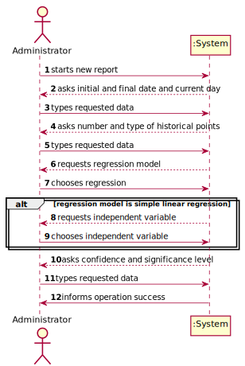
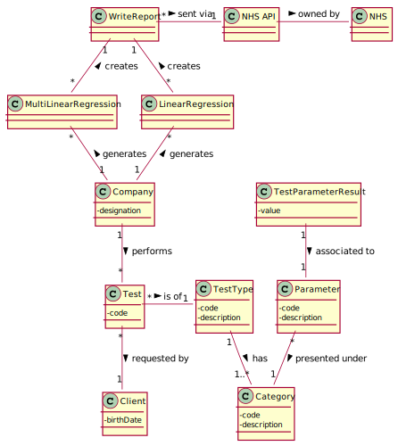
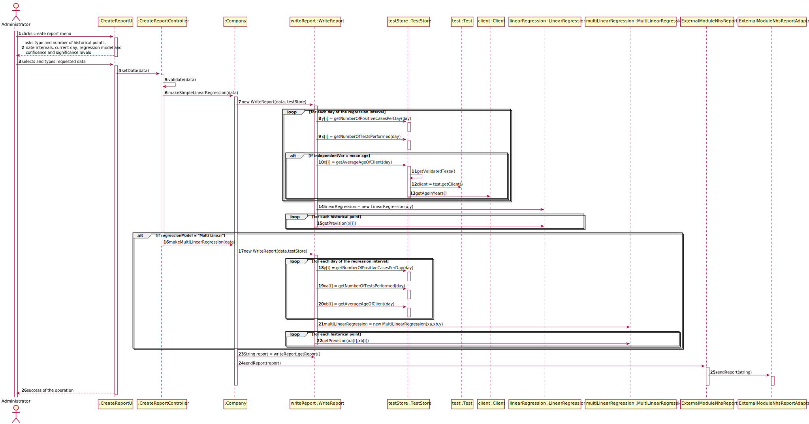

# US 18 - NHS Reports

## 1. Requirements Engineering

### 1.1. User Story Description

*As an Administrator I want to send the Covid-19 report to the NHS at any time. I
 want to define the interval of dates to fit the regression model, the number of historical
 points (number of days or number of weeks) that must be sent to the NHS, the regression
 model to use and select the independent variables to use*

### 1.2. Customer Specifications and Clarifications 

**From the Specifications Document:**
>"the NHS in England requires Many Labs to summarize and report Covid-19 data, the company
  needs to: identify the number of Covid-19 tests performed, identify all positive results to Covid-19
  tests, report the total number of Covid-19 cases per day, per week and per month of the year, and
  send the forecasts for these same time horizons (the number of Covid-19 cases for the following
  day, next week and next month)"

**From the client clarifications:**
* **Q1** Which significance level should we use for the hypothesis tests?
        
    A: The application should allow the user to choose the significance level.
* **Q2** Should the report contain the data of all the tests with results (with or without report, with or without validation) or contain only the validated tests? (Or other option?)
        
    A: The NHS Covid report should include statistics computed only from validated tests.
* **Q3** In US 18, should we ask the user to select which parameter he/she wants be analyzed for the hypothesis tests (a or b)?
    
    A: Yes.
    
* **Q4** If on a certain day or week there aren't any Covid 19 tests realized and therefore no clients, should we consider the mean age to be 0?
    
    A: Yes, you should consider the mean age to be zero. Sundays should not be considered in your analysis.

### 1.3. Acceptance Criteria

**_AC 1:_** The system should allow the Administrator to select
            between a simple linear and multilinear regression model to fit the data.
            Moreover, the Administrator should be able to choose the independent variable to
            use with the simple linear regression model (either the number of tests realized or 
            the mean age). The system should send the report using the NHS API
            
**_AC 2:_** The report can only include validated tests. 

**_AC 3:_** Sundays should not be counted in the prediction table.  

**_AC 4:_** If there are no tests performed in one day, the mean age of the clients should be considered 0.

### 1.4. Found out Dependencies

### 1.5 Input and Output Data

**Imput** 
**Typed Data:**

Number of historical points

Current Day

Initial Day for Regression

Final Day for Regression

Significance level

Confidence level

**Selected Data:**

Type of Historical points

Regression model

Independent variable

### 1.6. System Sequence Diagram (SSD)

### 1.7 Other Relevant Remarks

## 2. OO Analysis

### 2.1. Relevant Domain Model Excerpt

### 2.2. Other Remarks

*Use this section to capture some aditional notes/remarks that must be taken into consideration into the design activity. In some case, it might be usefull to add other analysis artifacts (e.g. activity or state diagrams).* 

## 3. Design - User Story Realization 

### 3.1. Rationale

**The rationale grounds on the SSD interactions and the identified input/output data.**

| Interaction ID | Question: Which class is responsible for... | Answer  | Justification (with patterns)  |
|:-------------  |:--------------------- |:------------|:---------------------------- |
| Step 1 start a report 		 |	instantiating a new report?	|  Company |   Creator Pattern: Company contains an object from the WriteReport class      |
| Step 2 types in and selects the data		 |	saving the input?				 | CreateReportUI |  Responsible for all the user-system interactions                            |
| Step 3 get the positive cases of Covid	 |	returning positive Covid cases		 | TestStore |  	Information Expert: knows its own data                            |
| Step 4 send the report 	|	sending the string report						 |  NhsExternalApi |                              |
| Step 5 shows operation success  	 |	informing operation success?		 |  CreateReportUI   |  Responsible for all the user-system interactions     |

### Systematization ##

According to the taken rationale, the conceptual classes promoted to software classes are: 

 * LinearRegression
 * MultiLinearRegression
 * WriteReport

Other software classes (i.e. Pure Fabrication) identified: 
 * CreateReportController
 * CreateReportUI

## 3.2. Sequence Diagram (SD)

## 3.3. Class Diagram (CD)

# 4. Tests 

**Test 1:** Check that it is not possible to create an instance of the Example class with null values. 

	@Test(expected = IllegalArgumentException.class)
		public void ensureNullIsNotAllowed() {
		Exemplo instance = new Exemplo(null, null);
	}

# 5. Construction (Implementation)

*In this section, it is suggested to provide, if necessary, some evidence that the construction/implementation is in accordance with the previously carried out design. Furthermore, it is recommeded to mention/describe the existence of other relevant (e.g. configuration) files and highlight relevant commits.*

*It is also recommended to organize this content by subsections.* 

# 6. Integration and Demo 

*In this section, it is suggested to describe the efforts made to integrate this functionality with the other features of the system.*

# 7. Observations

*In this section, it is suggested to present a critical perspective on the developed work, pointing, for example, to other alternatives and or future related work.*

