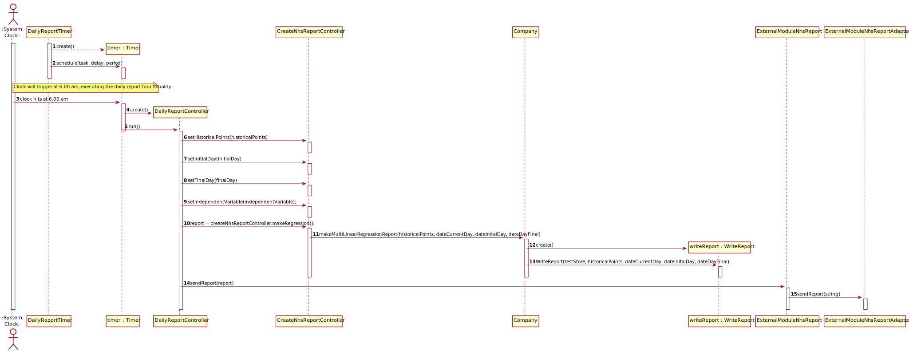
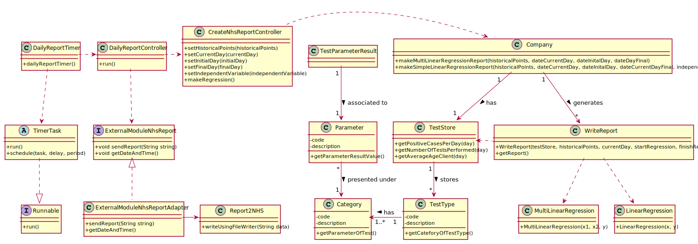

# US 19 - NHS Daily Reports

## 1. Requirements Engineering

### 1.1. User Story Description

*The Many Labs company wants to send to the NHS daily reports of Covid-19
 data, including the number of observed values and estimated values. Reports should be
 generated automatically with historical data and must be sent every day at 6:00 am.*

### 1.2. Customer Specifications and Clarifications 

**From the Specifications Document:**
>"The company is also required to generate daily (automatic) reports
 with all the information demanded by the NHS and should send them to the NHS using their API.
 To make the predictions, the NHS contract defines that a linear regression algorithm should be used.
 The NHS required that both simple linear and multiple linear regression algorithms should be
 evaluated to select the best model."

**From the client clarifications:**
* **Q1**: I would like to know if will be given a Multiple Linear Regression Class 
  to work, or should it be developed by the groups?
    * **A**: The Multiple Linear Regression Class should be developed by each team. 
      In moodle I made available a Java file with Simple Linear Regression.
      The teams should not use libraries or other external modules to implement linear 
      regression.

* **Q2**: As the report is generated automatically, should the system generate a 
  notication that the report was sent?
  * **A**: The application should write the event into a log file.

* **Q3**: Regarding US18 and US19, it is only one report containing all the tests performed
  by Many Labs to be sent each time, correct? Or is it one report per laboratory,
  for example? Or other option?
  * **A**: The report should contain all the tests made by Many Labs.

* **Q4**: Should the report contain the data of all the tests with results
  (with or without report, with or without validation) or contain only
  the validated tests? (Or other option?)
  * **A**: The NHS Covid report should include statistics computed only from validated tests.

* **Q5**: Which significance level should we use for the hypothesis tests?
  * **A**: The application should allow the user to choose the significance level.

* **Q6**: From the project description it is known "send the forecasts for these same
  time horizons (the number of Covid-19 cases for the following day, next week and
  next month)." In the example report we have in moodle, there is a line that says
  "// Prediction values". Does this mean that after this line we should put our predictions,
  or it refers to the following table?
    * **A**: Yes, the prediction values are the ones available in the table that we include
      in the example.

* **Q7**: Which class is responsible for creating the scheduler(s)? Should we assume the
  report scope is Many Labs or is it each laboratory?
    * **A**: Many Labs has exclusivity for doing Covid-19 tests and should send 
      nationwide reports to NHS. The scope is Many Labs.

* **Q8**: How it is supposed to evaluate the performance of the Simple Linear Regression
  for the different independent variables??
    * **A**: You should apply anova and from the best r2 you can conclude which fits better

### 1.3. Acceptance Criteria

**_Acceptance Criteria 1:_** The report should include day and week (observed and
estimated) values, the regression model used to estimate each value, R(SLR), R2
and R2 adjusted for SLR and MLR, hypothesis tests for regression coefficients
significance model with Anova. Simple linear and multilinear regression models
can be used to compute the estimates and corresponding confidence intervals.
When the system is configured to use the simple linear regression model, the
performance of each model should be used to select the best model (the one that
uses the number of tests realized or the one that uses the mean age as independent
variable). The best model will be used to make the estimated/expected values that
will be send to NHS. The interval of dates to fit the regression model and the
number of historical points (number of days and number of weeks) must be
defined through a configuration file. The system should send the report using the
NHS API (available in moodle).

**_Acceptance Criteria 2:_** Only validated tests should be considered in this user
story.

### 1.4. Found out Dependencies

*Identify here any found out dependency to other US and/or requirements.*

### 1.5 Input and Output Data

**_There's neither input nor output data in this user story._**

### 1.6. System Sequence Diagram (SSD)

### 1.7 Other Relevant Remarks

*Use this section to capture other relevant information that is related with this US such as (i) special requirements ; (ii) data and/or technology variations; (iii) how often this US is held.* 

## 2. OO Analysis

### 2.1. Relevant Domain Model Excerpt

### 2.2. Other Remarks

*Use this section to capture some aditional notes/remarks that must be taken into consideration into the design activity. In some case, it might be usefull to add other analysis artifacts (e.g. activity or state diagrams).* 

## 3. Design - User Story Realization 

### 3.1. Rationale

**The rationale grounds on the SSD interactions and the identified input/output data.**

| Interaction ID | Question: Which class is responsible for... | Answer  | Justification (with patterns)  |
|:-------------  |:--------------------- |:------------|:---------------------------- |
| Step 1 - Clock trigger at 6.00 am | creating a timer which will be triggered at 6.00 am?| DailyReportTimer |  |

### Systematization ##

According to the taken rationale, the conceptual classes promoted to software classes are: 

 * Class1
 * Class2
 * Class3

Other software classes (i.e. Pure Fabrication) identified: 
 * DailyReportController

## 3.2. Sequence Diagram (SD)

## 3.3. Class Diagram (CD)

# 4. Tests 

**Test 1:** Check that it is not possible to create an instance of the Example class with null values. 

	@Test(expected = IllegalArgumentException.class)
		public void ensureNullIsNotAllowed() {
		Exemplo instance = new Exemplo(null, null);
	}

# 5. Construction (Implementation)

*In this section, it is suggested to provide, if necessary, some evidence that the construction/implementation is in accordance with the previously carried out design. Furthermore, it is recommeded to mention/describe the existence of other relevant (e.g. configuration) files and highlight relevant commits.*

*It is also recommended to organize this content by subsections.* 

# 6. Integration and Demo 

*In this section, it is suggested to describe the efforts made to integrate this functionality with the other features of the system.*

# 7. Observations

*In this section, it is suggested to present a critical perspective on the developed work, pointing, for example, to other alternatives and or future related work.*

