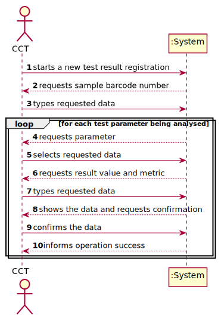
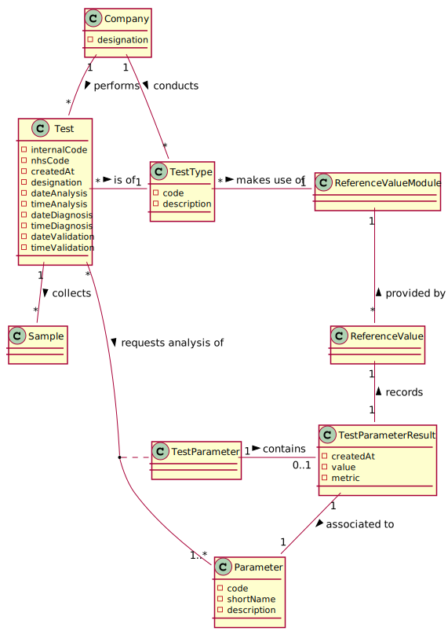
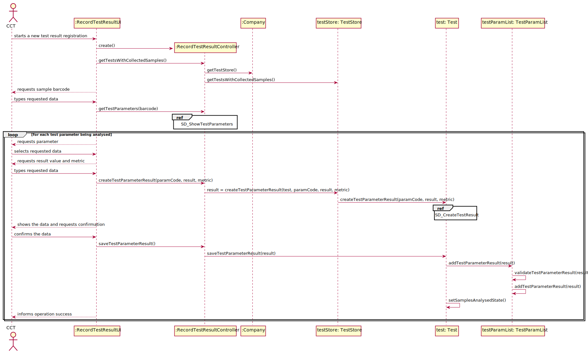
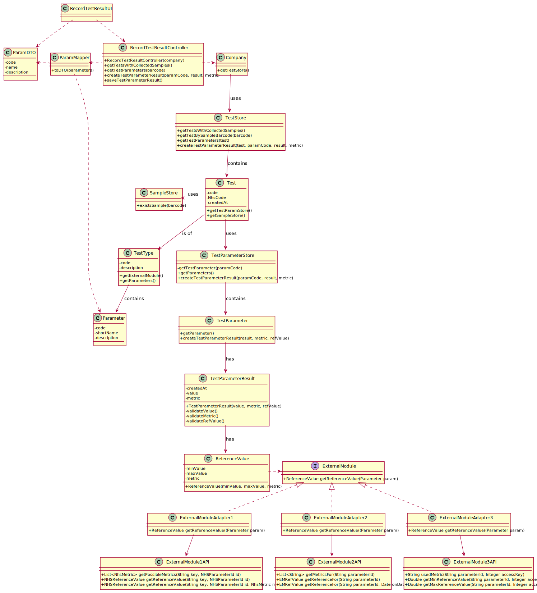

# US12 - Record test results

## 1. Requirements Engineering

### 1.1. User Story Description

As a clinical chemistry technologist, I intend to record the results of a given test

### 1.2. Customer Specifications and Clarifications 

**From the Specifications document:**
* "The clinical chemistry technologist receives the samples (delivered
  by a courier) and performs the chemical analysis, recording the results in the software application."
  
* "…the application uses an external module that is responsible for doing an automatic validation using
  test reference values."
  
**From the Client clarifications:**
* **Q: From the Acceptance Criteria we get that "the API request should include, at most: (i) a key to access the module (e.g.: “KEY1234”); (ii) a parameter identifier; (iii) the reference date; and (iv) reference measurement unit (e.g. "mg").**
  
  **Does this "at most" express that there are some parameters of the API request that are optional? If so, could you clarify the parameters that are optional?**

  * **A:** "At most" means the maximum number of parameters that will be used. Depending on the API being used, all parameters above may be required or some may be optional. Did you already studied ESOFT (Protected Variations) and the APIs provided in moodle?

    Important: The number of parameters depends on the API that is being used.
  
* **Q: When the Clinical Chemistry Technologist wants to record the results of a test, how does he has access to that test? By internal code, NHS code?**
  
  * **A:** Each sample has a unique barcode. The clinical chemistry technologist should use the sample barcode number to find the test for which the sample was collected.

* **Q: Should the system present a result for each test parameter or a single result for the test to be recorded?**

  * **A:** The Clinical Chemistry Technologist should register a value/result for each parameter of the test.

### 1.3. Acceptance Criteria

**AC1:** The application should use an external module that is responsible for providing the test reference values. 

The application can use an external module for each type of test. 

For instance, when the results are for blood tests parameters, the external module *BloodReferenceValues1API* can be used. When the results are for Covid-19 tests parameters, the external module *CovidReferenceValues1API* can be used.

In any case, the API request should include, at most: (i) a key to access the module (e.g.:“KEY1234”); (ii) a parameter identifier; (iii) the reference date; and (iv) reference measurement unit (e.g. "mg").

### 1.4. Found out Dependencies

* **US7 - Register an employee**: The clinical chemistry technologist must have been previously registered in the system and have access credentials.
* **US4 - Register a test**: The test for which results were generated must have been previously registered in the system.

### 1.5 Input and Output Data

**Input Data**
* **Typed data:** result, barcode number
* **Selected data:** parameter(s)

**Output Data**
* (In)Success of the operation

### 1.6. System Sequence Diagram (SSD)

### 1.7 Other Relevant Remarks

None

## 2. OO Analysis

### 2.1. Relevant Domain Model Excerpt 

### 2.2. Other Remarks

None.

## 3. Design - User Story Realization 

### 3.1. Rationale

**The rationale grounds on the SSD interactions and the identified input/output data.**

| Interaction ID | Question: Which class is responsible for... | Answer  | Justification (with patterns)  |
|:-------------  |:--------------------- |:------------|:---------------------------- |
| Step 1 - starts a new test result registration |...selecting and returning the tests to display?							 | TestStore            | High Cohesion/Low Coupling                             |
| Step 3 - types requested data  		 |...searching and returning Test from barcode?							 | SampleList / TestStore            |  High Cohesion/ Low Coupling IE                            |
| Step 4 - requests parameter 		 |...returning parameters from Test?							 |TestParamList             |  High Cohesion/Low Coupling IE                            |
| Step 7 - types result and metric		 |...storing the information? ...creating a TestParameterResult object?							 |TestParameterResult TestParameter            |  IE   Creator                           |
| Step 9 - confirms the data  		 |...saving the TestParameterResult?							 |  TestParamList           |   IE                           |              

### Systematization ##

According to the taken rationale, the conceptual classes promoted to software classes are: 

 * TestStore
 * SampleList
 * TestParamList
 * TestParameter
 * TestParameterResult

Other software classes (i.e. Pure Fabrication) identified: 
 * RecordTestResultUI  
 * RecordTestResulController

## 3.2. Sequence Diagram (SD)

## 3.3. Class Diagram (CD)

# 4. Tests 
*In this section, it is suggested to systematize how the tests were designed to allow a correct measurement of requirements fulfilling.* 

**_DO NOT COPY ALL DEVELOPED TESTS HERE_**

**Test 1:** Check that it is not possible to create an instance of the Example class with null values. 

	@Test(expected = IllegalArgumentException.class)
		public void ensureNullIsNotAllowed() {
		Exemplo instance = new Exemplo(null, null);
	}

*It is also recommended to organize this content by subsections.* 

# 5. Construction (Implementation)

*In this section, it is suggested to provide, if necessary, some evidence that the construction/implementation is in accordance with the previously carried out design. Furthermore, it is recommeded to mention/describe the existence of other relevant (e.g. configuration) files and highlight relevant commits.*

*It is also recommended to organize this content by subsections.* 

# 6. Integration and Demo 

*In this section, it is suggested to describe the efforts made to integrate this functionality with the other features of the system.*

# 7. Observations

*In this section, it is suggested to present a critical perspective on the developed work, pointing, for example, to other alternatives and or future related work.*

