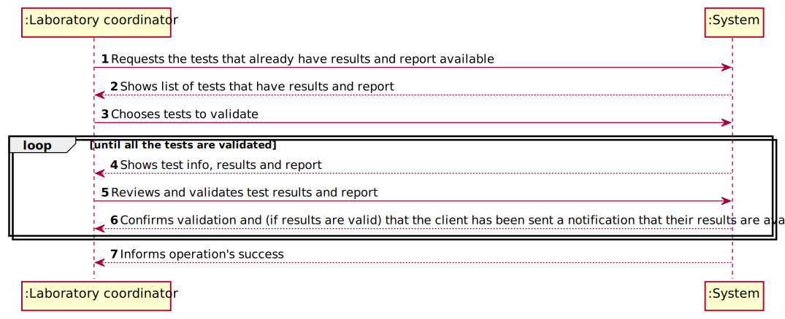
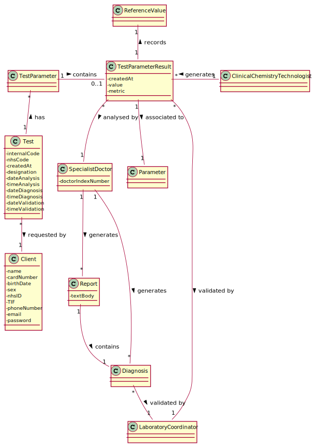
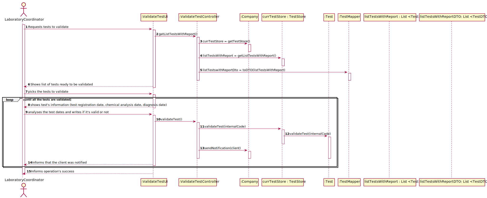
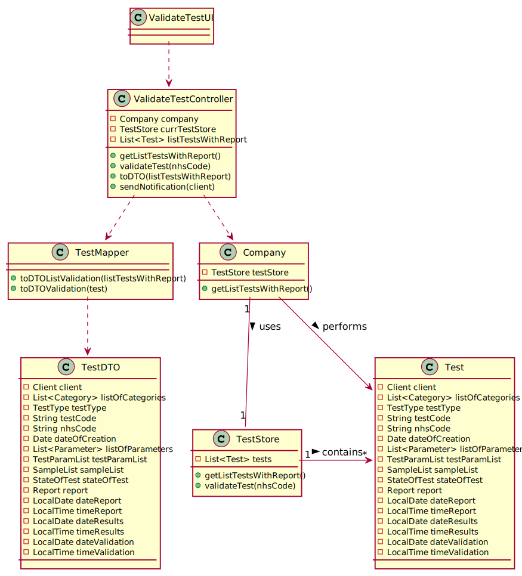

# US 15 - validate the work done by the clinical chemistry technologist and specialist doctor

## 1. Requirements Engineering

### 1.1. User Story Description

As a laboratory coordinator, I want to validate the work done by the clinical chemistry technologist and specialist doctor.

### 1.2. Customer Specifications and Clarifications

####From the specifications document

* "After the specialist doctor has completed the diagnosis, the results of the clinical analyses and the report become available in the system and must be validated by the laboratory coordinator."
* "To validate the work done, the laboratory coordinator checks the chemical test/result and associated diagnosis made and confirms that everything was done correctly."
* "Once the laboratory coordinator confirms that everything was done correctly, the client receives a notification alerting that the results are already available in the central application and informing that he/she must access the application to view those results."
* "The client receives the notification by SMS and e-mail. At the same time the results are also available in the central application where the medical lab technicians who collect the samples, the clinical chemistry technologist, the specialist doctor, and the laboratory coordinator can check them."

####From the client clarifications

* **Q1**: "Does the laboratory coordinator choose which client's results to validate?" **A**: "The laboratory coordinator chooses a set of tests he wants to validate."
* **Q2**: "Does the laboratory coordinator review the work of the specialist doctor and clinical chemical technologist's work separately or both at the same time?" **A**: "I already answered this question."
* **Q3**: "Does the notification sent to client informing them that they have their results on the central application get sent automatically after the laboratory coordinator confirms the clinical chemistry technologist and specialist doctor's work?" **A**: "From the Project Description: "Once the laboratory coordinator confirms that everything was done correctly, the client receives a notification alerting that the results are already available in the central application and informing that he/she must access the application to view those results.""
* **Q4**: "When the laboratory coordinator wants to validate a test does all the tests available show up for him or does he search using a code that identifies a specific test?" **A**: "The system shows all tests ready to validate (tests that already have the test registration date, the chemical analysis date and the diagnosis date registered in the system) and the laboratory coordinator selects one or more tests to mark as validated."
* **Q5**: "What should happen to a test if either the test report or the results are invalid? Should we prompt for a redo of either process or simply erase the test?" **A**: "The laboratory coordinator only sees the test dates of tests that already have all dates registered in the system (test registration date, the chemical analysys date and the diagnosis date)."
* **Q6**: "After validation do we need to have the time and date of the validation?" **A**: "Yes, the system should record the date (DD/MM/YYYY) and time (HH:MM) when the validation was made. Moreover, in this US, when the system shows to the laboratory coordinator all the dates (test registration date, chemical analysis date and diagnosis date), the system should show the date (DD/MM/YYYY) and the time (HH:MM)."
* **Q7**: "As soon as a test is validated should the system send the notification to a txt file like in sprint B?" **A**: "Please read carefully my answers!In the Project Description we get: "Once the laboratory coordinator confirms that everything was done correctly, the client receives a notification alerting that the results are already available in the central application and informing that he/she must access the application to view those results. The client receives the notification by SMS and e-mail. In a previous post in this forum: "During the development of the Integrative Project we will not use any e-mail or SMS API services to send messages. All the e-mail and SMS messages should be written to a file with the name emailAndSMSMessages.txt. This file simulates the use of e-mail and SMS API services.""

### 1.3. Acceptance Criteria

* Acceptance Criteria: The system does not show client personal information but shows all dates (test registration date, chemical analysis date and diagnosis date).

### 1.4. Found out Dependencies

* There is a dependency to "US012 As a clinical chemistry technologist, I intend to record the results of a given test" considering that the results to a given test need to exist for the laboratory coordinator to validate them.
* There is a dependency to "US014 As a specialist doctor, I intend to make the diagnosis and write a report for a given test." seeing that there needs to be a  in order to be validated by the laboratory coordinator.

### 1.5 Input and Output Data

* **Typed data:** Validation for the tests
* **Selected data**: Tests to be validated
* **Output data**: Validation's success

### 1.6. System Sequence Diagram (SSD)

### 1.7 Other Relevant Remarks

* **Special requirements**: None;
* **Data and/or technology variations**: None
* **Frequency**: This US will happen frequently throughout the application's lifetime, being used after every test's results come in.

## 2. OO Analysis

### 2.1. Relevant Domain Model Excerpt

## 3. Design - User Story Realization

### 3.1. Rationale

**The rationale grounds on the SSD interactions and the identified input/output data.**

| Interaction ID | Question: Which class is responsible for... | Answer  | Justification (with patterns)  |
|:-------------  |:---------------------|:------------|:---------------------------- |
| Step 1: Requests the tests that already have results and report available |	... storing all the tests in the system? | TestStore | IE: knows its own objects |
| Step 2: Shows list of tests that have results and report | ... showing all the tests? | ValidateTestUI | Pure Fabrication: responsible for user interactions |
| Step 3: Chooses tests to validate | N/A |  |  |
| Step 4: Shows test info, results and report | ...getting the tests? | TestMapper | Low coupling: reduces dependency between classes |
| Step 5: Reviews and validates test results and report | ... saving the test results and report's state? | Test | IE: knows its own state |
| Step 6: Confirms validation and (if results are valid) that the client has been sent a notification that their results are available | ... sending the notification to the client? |  |  |
| Step 7: Informs operation's success | N/A |  |  |

### Systematization ##

According to the taken rationale, the conceptual classes promoted to software classes are:

*

Other software classes (i.e. Pure Fabrication) identified:
* ValidateTestUI
* ValidateTestController

## 3.2. Sequence Diagram (SD)

## 3.3. Class Diagram (CD)

# 4. Tests

**_DO NOT COPY ALL DEVELOPED TESTS HERE_**

**Test 1:** Check that it is not possible to create an instance of the Example class with null values.

	@Test(expected = InvalidNameException.class)
    public void testNullName(){
        String name = "";
        String code = "12345";
        String description = "Red blood cells";

        Parameter par = new Parameter(name, code, description);
    }

# 5. Construction (Implementation)

## Class CreateNewParameterController

    public void createNewParameter(String shortName, String code, String description) {
    this.par = this.pc.createNewParameter(shortName, code, description);
    }

# 6. Integration and Demo

# 7. Observations

*In this section, it is suggested to present a critical perspective on the developed work, pointing, for example, to other alternatives and or future related work.*

