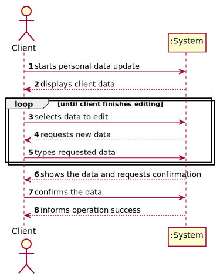
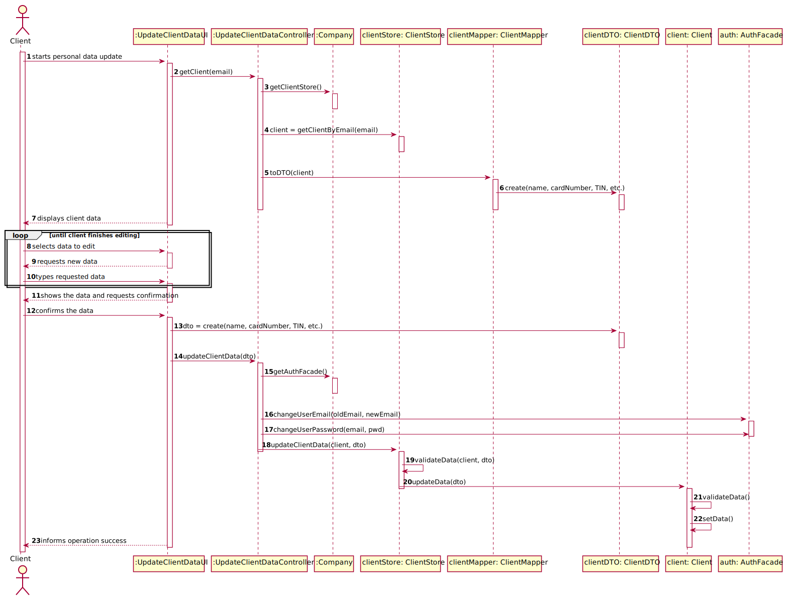

# US 2 -  Update Client Personal Data

## 1. Requirements Engineering

### 1.1. User Story Description

As a client, I want to update my personal data.

### 1.2. Customer Specifications and Clarifications 

**From the Specifications Document:**
* Client personal data is as follows: 
  
  *"To register a client, the receptionist needs the client’s citizen card number, National Healthcare Service (NHS) number, birth date, sex, Tax Identification number (TIF), phone number, e-mail and name."*

**From the client clarifications:**
* **Q1: Should the Client type in the attribute he/she wants to update or should he choose from a list?**
  
  **Q2: To update the attribute, should the Client type the previous data?**
  
  **Q3: What is the Data that the Client can update?**
  
  **A:** In this sprint each team should develop a graphical user interface for US2. The application should show the current user data and the client can update any attribute.

### 1.3. Acceptance Criteria

* **AC1:** The client can update any attribute.
* **AC2:** The client should be able to login with new credentials.
* **AC3:** The team should develop a graphical user interface.

### 1.4. Found out Dependencies

* **US3:** Register a client.

### 1.5 Input and Output Data

**Input Data**
* **Typed data:** name, card number, NHS number, birth date, TIN, phone number, e-mail and password. 
* **Selected data:** sex

**Output Data**
* Current personal data
* (In)Success of the operation

### 1.6. System Sequence Diagram (SSD)

### 1.7 Other Relevant Remarks

* **Special requirements:** Graphical User Interface.
* **Data and/or technology variations:** None.
* **Frequency:** This US will happen several times.

## 2. OO Analysis

### 2.1. Relevant Domain Model Excerpt

### 2.2. Other Remarks

*Use this section to capture some aditional notes/remarks that must be taken into consideration into the design activity. In some case, it might be usefull to add other analysis artifacts (e.g. activity or state diagrams).* 

## 3. Design - User Story Realization 

### 3.1. Rationale

**The rationale grounds on the SSD interactions and the identified input/output data.**

| Interaction ID | Question: Which class is responsible for... | Answer  | Justification (with patterns)  |
|:-------------  |:--------------------- |:------------|:---------------------------- |
| **2. displays client data** |...knowing the client? | AuthFacade Company ClientStore| IE: Auth knows the e-mail of the logged in client.   IE: Company knows all clients.   HCLC: All clients are stored in the Client Store.|
| | ...knowing which data to display? | Client | IE: Client knows its own data.
| | ...displaying the client tests? | ShowTestResultsUI | PF: There is no reason to assign this responsibility to any existing class in the Domain Model. |
| **5. types requested data**| ...storing the new data? | ClientDTO | PF:  There is no reason to assign this responsibility to any existing class in the Domain Model. |
| **6. shows data and requests confirmation**| ...displaying the data? | ShowTestResultsUI | PF: There is no reason to assign this responsibility to any existing class in the Domain Model. |
| **8. informs operation success**| ...validating the new data? | AuthFacade ClientStore Client | IE (Global validation): Auth knows all users' data  IE (Global validation): ClientStore know all other clients  IE (Local validation): Client knows its own attributes' acceptance rules.|
| | ...saving the new data? | Client | IE: Client knows its own data. | 
*Note: IE - Information Expert   HCLC - High Cohesion Low Coupling   PF: Pure Fabrication*

### Systematization ##

According to the taken rationale, the conceptual classes promoted to software classes are: 

 * AuthFacade
 * Company
 * ClientStore
 * Client
 * ClientDTO

Other software classes identified: 
 * UpdateClientDataUI (applying the Pure Fabrication pattern)  
 * UpdateClientDataController (applying the Pure Fabrication pattern)

## 3.2. Sequence Diagram (SD)

## 3.3. Class Diagram (CD)

# 4. Tests 

# 5. Construction (Implementation)

*In this section, it is suggested to provide, if necessary, some evidence that the construction/implementation is in accordance with the previously carried out design. Furthermore, it is recommeded to mention/describe the existence of other relevant (e.g. configuration) files and highlight relevant commits.*

*It is also recommended to organize this content by subsections.* 

# 6. Integration and Demo 

*In this section, it is suggested to describe the efforts made to integrate this functionality with the other features of the system.*

# 7. Observations

*In this section, it is suggested to present a critical perspective on the developed work, pointing, for example, to other alternatives and or future related work.*

